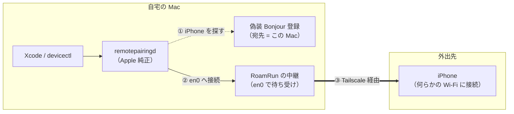
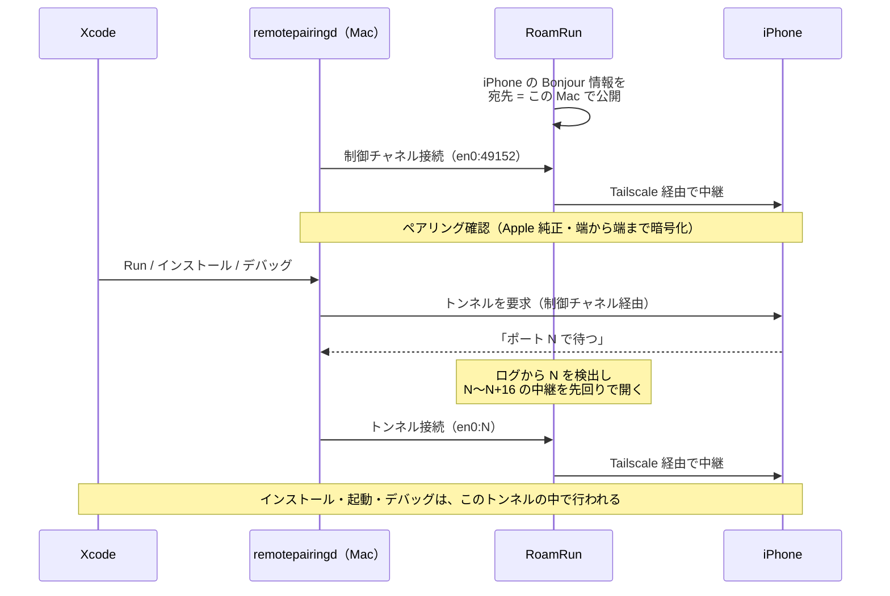

<p align="center">
  
</p>

<h1 align="center">RoamRun</h1>

<p align="center"><strong>Run your iOS apps wherever your device is.</strong></p>

<p align="center">
  <a href="https://github.com/mh-mobile/RoamRun/actions/workflows/ci.yml"></a>
  <a href="LICENSE"></a>
  
</p>

<p align="center"><a href="README.md">English</a> | 日本語</p>

<p align="center"></p>

Xcode のワイヤレスデバッグを、Tailscale などの mesh VPN 越しに使えるようにする macOS メニューバーアプリ。

iPhone が Mac と別の Wi-Fi ネットワークにいる状態でも、Xcode（`devicectl`/`remoted`）からはローカルにいるデバイスとして見え続けます。

## なぜ必要か

iOS 17+ のワイヤレスデバッグは CoreDevice スタック上で動き、デバイス発見は Bonjour/mDNS (`_remotepairing._tcp`) に依存しています。mDNS はリンクローカルマルチキャストなので、Tailscale のような L3 ユニキャスト VPN には乗りません。さらに Mac 側の `remotepairingd` は Bonjour で発見したインターフェースに接続をスコープするため、単に iPhone の tailnet IP を偽装広告しても接続は失敗します。

## 仕組み

ひとことで言うと、**Xcode には「iPhone は同じ Wi-Fi にいる」と見せかけ、実際の通信は Tailscale に流します。**



1. Xcode の裏で動く `remotepairingd` は、同じネットワークにいる iPhone を Bonjour（`_remotepairing._tcp`）で探します。RoamRun は、事前に取り込んだ iPhone の Bonjour 情報を「接続先はこの Mac 自身」として公開し直します。
2. `remotepairingd` は、その iPhone が同じ Wi-Fi にいると思って Mac 自身（en0）へ接続します。受けるのは RoamRun の中継です（この Mac 自身からの接続以外は拒否）。
3. 中継は通信を Tailscale 経由で iPhone に流します。中身（ペアリングの確認や暗号化）は Apple 純正の Mac⇄iPhone 間でそのまま行われ、RoamRun は読みも書き換えもしません。

接続の順序は次のとおりです。



- **トンネルのポートは毎回変わります**（1 つずつ増える）。`remotepairingd` は通知の約 5ms 後に接続してくるため、RoamRun はログ（`log stream`）でポートを見つけるたびに、その先 16 個まで中継を先回りで開けておきます。
- **ブリッジ起動直後の 1 回目**は、どうしても先回りが間に合いません。RoamRun は起動時に裏で `devicectl` を実行してこの 1 回目のトンネルを消費し、利用者の最初の Run から成功するようにしています。

## 要件

- macOS 13+、Apple Silicon（Intel Mac は非対応）。Mac の**管理者アカウント**で使うこと（RoamRun は `log stream` で remotepairingd のログを読みますが、macOS は管理者にしか許可していません）
- iPhone は iOS 17.4 以降（CoreDevice トンネルが TCP の世代。17.0–17.3 の QUIC/UDP トンネルは非対応）
- iPad、Apple Vision Pro でも同じ仕組みで動作を確認済み（以下「iPhone」はこれらも含みます）。Vision Pro はもともと USB がなく Wi-Fi だけで開発する端末なので、外出先からの利用とも相性が良いです
- Xcode（devicectl が使えること）
- Tailscale（または任意の mesh VPN + 手動 IP 指定）が Mac/iPhone 両方で接続済み
- iPhone をこの Mac と一度ペアリング済み（USB、または Xcode 27 + iOS 27 なら同じ Wi-Fi 上で Device Hub の「+」→「Pair Nearby Device…」）、デベロッパモード ON
- ブリッジ中も iPhone は**何らかの Wi-Fi に接続していること**（cellular 不可: remotepairingd は Wi-Fi association を前提に listen する）

## インストール

### Homebrew（推奨）

```sh
brew install --cask mh-mobile/tap/roamrun
```

`RoamRun.app` を `/Applications` に入れ、`roamrun` コマンドもリンクします。公証がないため、初回起動時に macOS に止められます（`brew upgrade` 後は不要）。一度開こうとした後、**システム設定 → プライバシーとセキュリティ → 「このまま開く」**で許可してください。

### ソースからビルド

```sh
git clone https://github.com/mh-mobile/RoamRun && cd RoamRun
```

- **試すだけ:** `make run` — リポジトリのフォルダ内に `RoamRun.app` をビルドして起動（インストール済みの RoamRun は先に終了。同時に 1 つしか起動しません）
- **普段使い:** `make app` → `RoamRun.app` を `/Applications` に移して起動し、アプリから CLI を入れる（[CLI](#cli) 参照）
- **RoamRun の開発:** `make install-cli` で `roamrun` をフォルダ内のビルドにリンク。`make app` のたびにすぐ反映されます。あとでアプリを移したら、アプリから CLI を入れ直してください

Xcode プロジェクト不要。SwiftPM + Makefile で `.app` を組み立てます。手元でビルドしたアプリはダウンロード扱いにならないため、Gatekeeper の警告は出ません。

### ビルド済み dmg（GitHub Releases）

Releases の dmg は**アドホック署名のみ（公証なし）**です。初回起動時に macOS に止められるので、次のどちらかで許可してください:

- 一度開こうとした後、**システム設定 → プライバシーとセキュリティ → 「このまま開く」**
- または `xattr -dr com.apple.quarantine /Applications/RoamRun.app`

最初の画面から `roamrun` コマンドも入れられます。

dmg は `make dmg` で作れます（`SIGN_ID` / `NOTARY_PROFILE` を渡すと Developer ID 署名と公証も行います。Makefile 参照）。

### アップデート

自動アップデートはありません。Homebrew なら `brew upgrade --cask roamrun`（RoamRun を終了してから置き換えます）。それ以外は RoamRun を終了し、`/Applications/RoamRun.app` を新しいものに置き換えて起動します（ソースからの場合は先に `git pull` と `make app`）。登録済みデバイスと CLI のリンクはそのまま残り、動いていたブリッジも再開します。dmg で更新した場合は初回インストールと同じく起動時に止められるので、もう一度「このまま開く」で許可してください。

## 使い方

1. iPhone を USB または同一 Wi-Fi に接続した状態でメニューバーアイコン → Open RoamRun → Add Device
2. 一覧から iPhone を選び、Tailscale 上の同じデバイス（または手動 IP）を紐付け
3. Start Bridge
   - iPhone が Mac と同じ Wi-Fi にいる間は「On this Wi‑Fi」として待機し（Xcode は直接 iPhone を見られるため）、別のネットワークに移ると自動でブリッジを始めます
4. Xcode の Devices ウインドウでデバイスが見え続け、ビルド・インストール・デバッグが可能

Mac の IP が変わるとブリッジは自動再起動します。

<p align="center">
  
  
</p>

## CLI

アプリ本体がそのまま CLI にもなります（SSH 先の Mac やスクリプト向け）。`roamrun` コマンド（`/usr/local/bin/roamrun`）の入れ方：

- **Homebrew:** リンク済み（Apple Silicon では `/opt/homebrew/bin/roamrun`）
- **dmg 版:** 最初の画面の「Also install the roamrun command for Terminal…」、または Open RoamRun → ⚙ Settings → Command line tool → **Install…**
- **ソースからビルドした場合:** `/Applications` に移したなら同じ手順。フォルダ内のビルドを使うなら `make install-cli`（`BINDIR=$HOME/bin` なども可）

```sh
roamrun devices               # 登録済み iPhone（名前・UDID）と状態
roamrun up <name>             # ブリッジを起動し、Ready まで表示。Ctrl-C で停止・後片付け
roamrun up <name> -d          # バックグラウンドで起動（ターミナルを閉じても継続。ログは ~/Library/Logs/RoamRun/）
roamrun status <name>         # Ready なら exit 0（スクリプトの待ち合わせ用。名前なしならどれか 1 台が Ready で 0）
roamrun down <name>           # ブリッジを停止（アプリ側・別ターミナルの up どちらでも）
roamrun doctor                # Mac → Tailscale → iPhone を順に診断し、直し方を表示
roamrun run <name> [--scheme S] [--logs]   # プロジェクトのフォルダで：ビルド → インストール → 起動（--scheme は複数あるときだけ。--logs で出力も流す。Xcode と同じく署名のプロファイルを作ることがある）
roamrun install <name> <App.ipa|App.app>   # その端末用に署名されたビルドをインストール（先に署名を確認）
roamrun logs <name> <bundle-id>   # アプリを起動し直し、print / os_log の出力を流す（Ctrl-C で停止）
# run と logs は起動オプションも取る（例：スクリーンショットの前に特定の画面を開く）:
#   --arg A（1 語ずつ、複数可。「-」で始まってもよい）  --env NAME=value（複数可）  --url myapp://settings
roamrun screenshot <name> [file.png]   # 実機の画面を PNG で保存し、パスを表示（Xcode 27）
```

オプション: `--json`（`devices`、`status`、`doctor`）、`--wait N`（`status`: 最大 N 秒 Ready を待つ）、`-v`（`up`: アクティビティログを表示）、`--workspace W` / `--project P` / `--configuration C`（`run`）。一覧は `roamrun --help` で表示されます。コマンドが受け付けないオプションはエラーになります（exit 2）。

`<name>` は iPhone 本体の名前ではなく、**RoamRun に登録した名前**です（大文字小文字は区別しません。`roamrun devices` で確認、アプリの詳細画面の ✏️ で変更可。名前は重複できません）。iPhone の登録（Add Device）はアプリで一度だけ行ってください。アプリと CLI が同じ iPhone を同時にブリッジしないよう、後から起動した側は起動を拒否します（相手がすでに Ready なら `up` は exit 0）。ただし、待機中（On this Wi‑Fi）やエラーのブリッジは引き継げます。`logs` はアプリを起動し直します（`devicectl` は、すでに動いているアプリにコンソールをつなげないため）。ブリッジ経由でも、同じ Wi-Fi でも使えます。

`install` には、**Debugging、Release Testing（Ad Hoc）、Enterprise** で書き出した `.ipa`（CI で作ったものなど）や `.app` を渡せます。端末の UDID がプロビジョニングプロファイルに入っている必要があります（Enterprise は、証明書を信頼した端末ならどれでも）。App Store Connect 用（App Store / TestFlight）のビルドは直接インストールできないので、`install` が実行前にそう伝えます。RoamRun が届くのはこの Mac とペアリング済みの端末だけです。ペアリングしていない端末にビルドを配るには、TestFlight や OTA 配布（Ad Hoc / Enterprise）を使ってください。

### ブリッジ経由で使えるほかのツール

ブリッジが Ready の間は、Xcode のコマンドラインツールからも、同じ Wi-Fi にいるときと同じように実機を扱えます。確認済みのもの:

```sh
xcrun devicectl device capture screenshot --device <udid> --destination shot.png   # `roamrun screenshot` の中身
xcrun devicectl device process launch --device <udid> <bundle-id>
xcodebuild test -destination id=<udid> …                                           # UI テスト（XCUITest）も実機で動く
xcrun devicectl device info files --device <udid> --domain-type appDataContainer --domain-identifier <bundle-id>   # アプリのファイル一覧
xcrun devicectl device copy from --device <udid> --domain-type appDataContainer --domain-identifier <bundle-id> --source <path> --destination <保存先>   # 取り出し（copy to で送り込み）
xcrun devicectl device info files --device <udid> --domain-type systemCrashLogs     # クラッシュログ（.ips）。取り出し方は同じ
```

UDID は `roamrun status <name>` で表示されます。UI テストが動くので、XCUITest ベースの操作ツール（AI エージェントが画面を読んでタップするもの）もブリッジ経由で動きます（試したもの: WebDriverAgent — 起動後は実機の Tailscale のアドレスで接続し、テザリング経由でタップ 1 回 約 2 秒。agent-device — 動くものの往復が多く 1 操作 25〜35 秒かかり、iPad のウィンドウ表示のアプリではタップがずれた）。同じ Wi-Fi にいるときより遅くなる前提で使ってください。ほかのツールも確認中です（[Issue](https://github.com/mh-mobile/RoamRun/issues): Instruments など）。

## AI エージェントから使う

Claude Code・Codex・Cursor などのエージェントに、ビルド〜実機インストール〜デバッグを任せられます。エージェントに使い方を教えるスキルを入れてください:

```sh
roamrun init                                  # ~ にあるエージェントすべて（.claude .codex .cursor .gemini .copilot）にスキルを配置
roamrun init --client claude                  # 指定したものだけに配置（--client は複数指定可）
```

`init` は、入っている RoamRun に同梱されたスキルを配置するので、CLI と版が必ず一致します。RoamRun を更新したら `roamrun init` をもう一度実行してください（入っているスキルの版が違うと、`roamrun status` と `doctor` が知らせます）。他のツールでスキルを管理する場合は、入っている RoamRun と同じリリースに固定してください（例: `gh skill install mh-mobile/RoamRun roamrun --pin "v$(roamrun --version | cut -d" " -f2)"`。main ブランチのスキルには、入っている版にまだ無いオプションが書かれていることがあります）。

スキルには、デバイスをつなぐ手順（`roamrun up -d` → `status --wait 60 --json` で UDID 取得）、「iPhone のロック解除など人間にしかできないこと」、スクリーンショットの撮り方が書かれています。ビルドや起動はエージェントのいつもの手順に任せ、`roamrun run` は 1 コマンドで済ませたいとき用です。CLI は `--json` と終了コード（0 準備完了 / 1 未準備・失敗 / 2 使い方の誤り）に対応しています。

## 外出先で iPhone だけで使う

Mac を自宅に置いたまま、手元の iPhone だけでビルド〜実機確認を回す使い方です。

**前提: iPhone がインターネットにつながった Wi-Fi に接続していること。** モバイル回線だけでは使えません（iPhone の RemotePairing が Wi-Fi 接続時しか待ち受けないため）。「インターネット未接続」と表示される Wi-Fi に接続し、通信だけモバイル回線に流す構成でも待ち受けないことを確認しています。カフェやホテルの Wi-Fi、ポケット Wi-Fi、別の端末のテザリングなどを使ってください（2 台目の iPhone のインターネット共有に接続するのは可。その iPhone 自身がインターネット共有をしている状態は、自分が Wi-Fi につながっていないので不可）。

**回線について:** Tailscale は通常、Mac と iPhone を直接つなぎます（`tailscale status` で iPhone の行が `direct <アドレス>`）。UDP をふさいだ公衆 Wi-Fi などでは Tailscale の中継サーバー（DERP）経由になり（`relay "tok"` など）、動作はしますが遅くなります。ログイン画面のある Wi-Fi は、ログインを済ませてから使ってください。モバイル回線のテザリング（遅延 約 80ms、direct）で、インストール・起動・Xcode のデバッグ実行（ブレークポイント）まで確認済みです。

iPhone から Mac を操作する方法は 3 つあります。どの方法でも、テスト中のアプリと操作用のアプリを同じ iPhone 上で切り替えながら使います（アプリがバックグラウンドに回っても接続は切れません）。

| 方法 | iPhone 側 | 向いている用途 |
|---|---|---|
| **AI エージェントに任せる（おすすめ）** | スマホから自宅 Mac のエージェントを操作する機能（Claude Code の [Remote Control](https://code.claude.com/docs/en/remote-control.md)、ChatGPT アプリ経由の [Codex](https://learn.chatgpt.com/docs/remote-connections) など） | 「ビルドして iPhone で動かして」と頼み、手元で確認して指摘する反復 |
| SSH でターミナル操作 | SSH クライアント（Blink Shell、Termius など）+ Tailscale。tmux でセッションを維持すると、どのエージェントも同様に使える | `roamrun` / `xcodebuild` / `devicectl` / `lldb` を直接使う |
| Mac の画面を遠隔操作 | 画面共有・VNC クライアント + Tailscale | Xcode の Run やブレークポイントを GUI で使う |

例: Claude Code なら、自宅 Mac で `claude --remote-control`（または `claude remote-control`）を起動しておき、iPhone の Claude アプリの「Code」から接続します。Mac 側のプロセスが動いている間だけ操作できます。エージェントに RoamRun のスキル（`roamrun init`）を入れておくと、「iPhone のロックを解除して」などの依頼も流れの中で伝えてくれます。

なお、これらの遠隔操作機能では、会話内容が各サービスのサーバーを経由・保存されます（会社支給の Mac では社内規定を確認してください）。

手に持って使っている間は画面がついているため、iPhone のスリープによる切断は起きにくくなります。置いたまま待つ場合は、自動ロックを長めにしてください。

## 構成

`Sources/RoamRun/` の主なファイル:

| ファイル | 役割 |
|---|---|
| `BonjourCapture.swift` | `dns-sd -Z` ゾーンダンプの解析（PTR/SRV/TXT/A） |
| `DNSServiceProxy.swift` | `dns-sd -P` 子プロセスによる偽装広告 + 孤児掃除 |
| `Relays.swift` | NWListener/NWConnection の TCP バイトリレー（この Mac 自身からの接続のみ受理） |
| `TunnelPortWatcher.swift` | `log stream` でトンネルポートを検出し、どの端末のものかを振り分け |
| `InterfaceMonitor.swift` | LAN インターフェースの選択（設定がなければ en0）と IP 変化の検知（getifaddrs + NWPathMonitor） |
| `ReachabilityProbe.swift` | TCP の到達確認と RemotePairing のハンドシェイク確認 |
| `ProxyBridge.swift` | 上記のオーケストレーション（1デバイス=1インスタンス） |
| `TailscaleClient.swift` | `tailscale status --json` と `tailscale ping` の解析 |
| `AppCoordinator.swift` | プロファイル管理・ブリッジ制御・プレゼンスチェック |
| `StatusFile.swift` | アプリと CLI で共有するブリッジの状態（どの端末をどちらが動かしているか） |
| `CLI.swift` | `roamrun` コマンド（アプリと同じバイナリ） |

## Mac に作るもの・アンインストール

RoamRun が書き込むのは次の場所だけです（システム設定や他のアプリには触れません）。

| 場所 | 内容 |
|---|---|
| `~/Library/Application Support/RoamRun/` | 登録した iPhone（`profiles.json`）とブリッジの状態 |
| `~/Library/Logs/RoamRun/` | `roamrun up -d` のログ |
| `io.github.mh-mobile.roamrun`（defaults。0.1.12 より前は `com.roamrun.app`） | 設定・前回動いていたブリッジ |
| `/usr/local/bin/roamrun` | アプリか `make install-cli` で CLI を入れた場合のみ（既存のファイルや他のツールのリンクは上書きしません）。Homebrew は代わりに `/opt/homebrew/bin/roamrun` にリンクします |
| `~/.claude/skills/roamrun/` など | `roamrun init` を実行した場合のみ（既存の他のスキルやリンクには触れません） |

ブリッジ中に起動する補助プロセス（`dns-sd` / `log stream`）は、RoamRun が強制終了しても通常 1 秒ほどで自動で終了し、LAN への広告も消えます。

まず `roamrun up -d` で始めたブリッジを止めます（`roamrun down <name>`）。アプリを消しても動き続けるためです。Homebrew なら、そのあと `brew uninstall --zap --cask roamrun` でアプリ・CLI のリンク・設定・ログを削除します（スキルは先に `roamrun init --uninstall`）。それ以外で完全に削除するには:

```sh
roamrun init --uninstall                  # スキルを入れた場合（他のツールで入れたならそのツールで削除）
rm /usr/local/bin/roamrun                 # CLI を入れた場合
rm -rf ~/Library/Application\ Support/RoamRun ~/Library/Logs/RoamRun
defaults delete io.github.mh-mobile.roamrun
defaults delete com.roamrun.app 2>/dev/null   # 0.1.12 より前の版が残したもの
# 最後に /Applications/RoamRun.app を削除（「ログイン時に開く」を有効にしていた場合は先に無効化）
```

## 制限・既知の課題

- **Apple の非公開プロトコルに依存しています。** iOS 17 以降の CoreDevice / RemotePairing（Bonjour `_remotepairing._tcp` → 制御チャネル → トンネル）の挙動を前提にしており、将来の iOS / macOS / Xcode で動かなくなる可能性があります。困ったらまず `roamrun doctor` を実行してください。
- ブリッジは **en0**（多くの Mac では Wi-Fi）で待ち受けます。この Mac が別のインターフェース（Mac mini の有線など）で LAN につながっている場合は、Open RoamRun › ⚙ Settings › Network で選んでください
- iPhone は**何らかの Wi-Fi に接続**している必要があります（別の端末のテザリングは可。セルラーのみや、その iPhone 自身のインターネット共有は不可: remotepairingd が Wi-Fi 接続時しか待ち受けないため）
- iOS の Tailscale は、スリープやネットワーク切り替えの後に「MagicSock function ReceiveIPv4 is not running」と表示して通信が止まることがあります（接続中の表示のまま）。VPN をオフ → オンにし、Tailscale アプリは最新に保ってください
- iPhone がスリープすると Tailscale（VPN 拡張）も休止し、外から届かなくなります。デバッグ中は iPhone のロックを解除し、画面をつけたままにしてください（自動ロックを長めに）
- remotepairingd は約 42 秒ごとに制御チャネルを張り直します（Mac 自身の IP への ARP 確認が通らないため）。トンネルは約 0.4 秒で自動復旧し、デバッグセッションは継続します
- Tailscale の中継サーバー（DERP）経由だと動作しますが遅くなります（`roamrun doctor` で経路を確認できます）
- 外出先では、**デバッガ付きの実行（⌘R）に時間がかかります**。lldb の接続には数百回の往復が必要で、回線の遅延やパケットロスがそのまま効くためです。往復の回数は読み込むフレームワークの数とともに増え、インストールの時間はアプリのサイズにほぼ比例します（実測: 約 600KB のアプリ、テザリング経由、遅延 約 25〜60ms で、デバッガ付き約 1 分、デバッガなし約 4 秒。転送速度は 0.4〜0.9MB/秒）。ブレークポイントが不要なときは Edit Scheme › Run › Info の「Debug executable」をオフに、デバッガを使うときは Options の「Queue Debugging」と Diagnostics の「Main Thread Checker」「Thread Performance Checker」をオフにすると速くなります
- iPhone 再起動後など、DDI の再ステージングで一度 USB 接続が必要な場合があります
- TXT の authTag/identifier が変わった場合は、同じ Wi-Fi で iPhone を追加し直してください
- ブリッジ中は、**この Mac が属するローカルネットワーク**（Wi-Fi・有線など mDNS が有効な全インターフェース）に iPhone の Bonjour 識別子（identifier / authTag）を広告し続けます。iPhone 本体と違い値が固定のため、同じネットワークの第三者に端末の存在を追跡される可能性があります。ノート型の Mac でブリッジしたままカフェやホテルの Wi-Fi に入ると、そこでも広告されます。そのネットワークの第三者は、広告を再送してブリッジを一時的に待機状態にさせることもできます（端末を操作されることはありません）。中継は、この Mac 自身から以外の接続を即座に切断します。iPhone 側の通信は Tailscale で暗号化されるため、iPhone がどの Wi-Fi にいても影響しません
- **動作確認は Xcode と `devicectl` で行っています。** Flutter や React Native も同じツールでビルド・インストールするため、ブリッジが Ready なら動くはずですが、まだ確認していません（[#5](https://github.com/mh-mobile/RoamRun/issues/5)）。`roamrun run` は今いるフォルダの Xcode プロジェクトをビルドします（Flutter / React Native なら先に `cd ios`）
- 開発しない期間は、iPhone のデベロッパモードをオフにする、または不要なペアリングを解除すると安全です（Apple の推奨）
- iPhone の RemotePairing のポートには、tailnet の他のメンバーからも到達できます（接続はできても、ペアリングの確認で弾かれます）。共有の tailnet では、Tailscale の Grants / ACL で iPhone に届く相手を自分の Mac に絞ることをおすすめします
- 同じネットワークに別の Mac がいると、その Mac の Xcode にもこの iPhone が一瞬表示されることがあります（接続は中継が拒否するため、操作や通信はできません）

## セキュリティ

RoamRun が何をどこに公開するか、脆弱性の報告方法は [SECURITY.md](SECURITY.md)（英語）を参照してください。

## 参考

この実装は以下の公開情報をベースにしています:

- Kevin Paterson, ["How to remotely iterate & deploy your sideloaded iOS-apps over tailnet"](https://dev.to/kvnpt/how-to-remotely-iterate-deploy-your-sideloaded-ios-apps-over-tailnet-jak) (DEV Community) — `dns-sd -P` + `socat` による同等構成の実証

## 関連プロジェクト

同じ課題（別ネットワークの iPhone に Xcode から届かせる）に取り組んでいるプロジェクトです。

- [Viaaaron/iphone-tailnet-bridge](https://github.com/Viaaaron/iphone-tailnet-bridge) — Bonjour と socat による中継をシェルスクリプトで実装
- [ahmadtawakol/iphone-tailnet-bridge](https://github.com/ahmadtawakol/iphone-tailnet-bridge) — 上記のフォーク。ネイティブ macOS アプリと Go 製ツールを追加
- [CodeEagle/remote-ios-deploy-skill](https://github.com/CodeEagle/remote-ios-deploy-skill) — 同じ手法（Bonjour プロキシ + TCP/UDP 中継）をエージェント用スキル（SKILL.md）にしたもの
- [lyo-eos/ios-ota](https://github.com/lyo-eos/ios-ota) — Tailscale 越しに署名済みアプリをインストール（Wi-Fi から 5G への切り替え後も継続）。Xcode の Run やデバッガではなく、インストールに特化

## ライセンス

[MIT](LICENSE)
