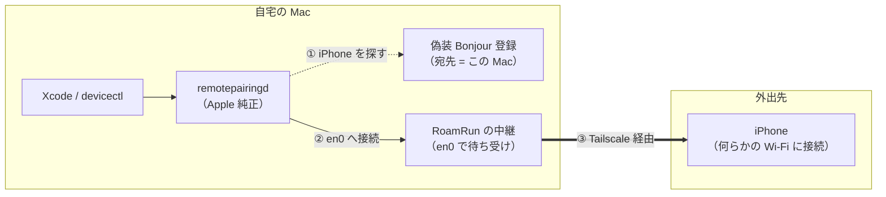
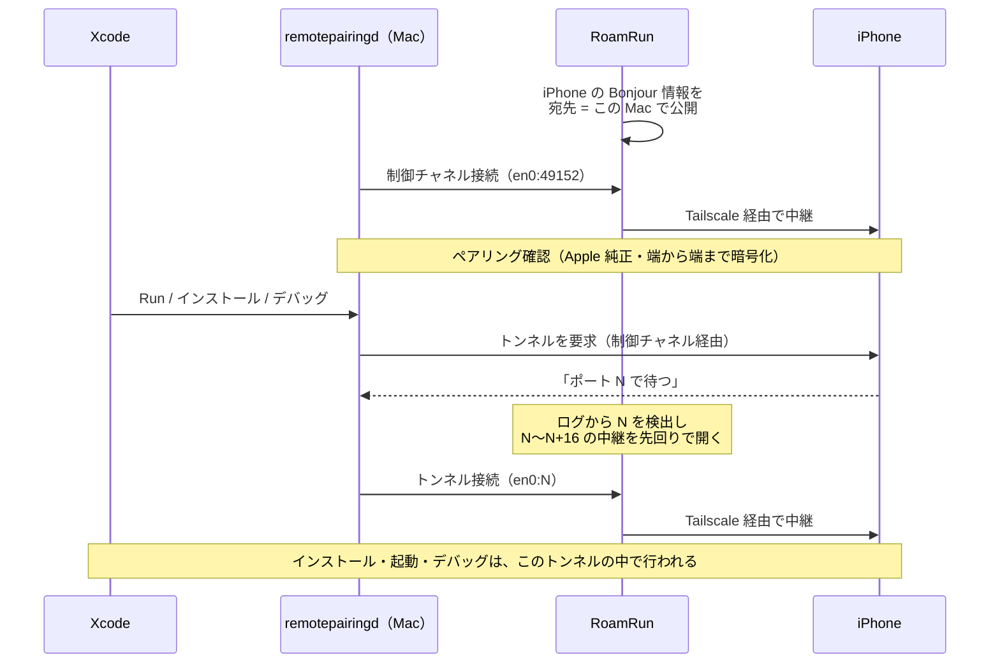

<p align="center">
  
</p>

<h1 align="center">RoamRun</h1>

<p align="center"><strong>Run your iOS apps wherever your device is.</strong></p>

<p align="center">
  <a href="https://github.com/mh-mobile/RoamRun/actions/workflows/ci.yml"></a>
  <a href="LICENSE"></a>
  
</p>

<p align="center"><a href="https://mh-mobile.github.io/RoamRun/">Web サイト</a> · <a href="README.md">English</a> | 日本語</p>

<p align="center"></p>

Xcode のワイヤレスデバッグを、Tailscale などの mesh VPN 越しに使えるようにする macOS メニューバーアプリ。

iPhone が Mac と別の Wi-Fi ネットワークにいる状態でも、Xcode（`devicectl`/`remoted`）からはローカルにいるデバイスとして見え続けます。

## なぜ必要か

iOS 17+ のワイヤレスデバッグは CoreDevice スタック上で動き、デバイス発見は Bonjour/mDNS (`_remotepairing._tcp`) に依存しています。mDNS はリンクローカルマルチキャストなので、Tailscale のような L3 ユニキャスト VPN には乗りません。さらに Mac 側の `remotepairingd` は Bonjour で発見したインターフェースに接続をスコープするため、単に iPhone の tailnet IP を偽装広告しても接続は失敗します。

## 仕組み

ひとことで言うと、**Xcode には「iPhone は同じ Wi-Fi にいる」と見せかけ、実際の通信は Tailscale に流します。**


```mermaid
flowchart LR
  subgraph mac["自宅の Mac"]
    xcode["Xcode / devicectl"] --> rpd["remotepairingd<br/>（Apple 純正）"]
    fake["偽装 Bonjour 登録<br/>（宛先 = この Mac）"]
    relay["RoamRun の中継<br/>（en0 で待ち受け）"]
  end
  subgraph away["外出先"]
    iphone["iPhone<br/>（何らかの Wi-Fi に接続）"]
  end
  rpd -. "① iPhone を探す" .-> fake
  rpd -- "② en0 へ接続" --> relay
  relay == "③ Tailscale 経由" ==> iphone
```

1. Xcode の裏で動く `remotepairingd` は、同じネットワークにいる iPhone を Bonjour（`_remotepairing._tcp`）で探します。RoamRun は、事前に取り込んだ iPhone の Bonjour 情報を「接続先はこの Mac 自身」として公開し直します。
2. `remotepairingd` は、その iPhone が同じ Wi-Fi にいると思って Mac 自身（en0）へ接続します。受けるのは RoamRun の中継です（この Mac 自身からの接続以外は拒否）。
3. 中継は通信を Tailscale 経由で iPhone に流します。中身（ペアリングの確認や暗号化）は Apple 純正の Mac⇄iPhone 間でそのまま行われ、RoamRun は読みも書き換えもしません。

接続の順序は次のとおりです。


```mermaid
sequenceDiagram
  participant X as Xcode
  participant R as remotepairingd（Mac）
  participant B as RoamRun
  participant P as iPhone
  B->>B: iPhone の Bonjour 情報を<br/>宛先 = この Mac で公開
  R->>B: 制御チャネル接続（en0:49152）
  B->>P: Tailscale 経由で中継
  Note over R,P: ペアリング確認（Apple 純正・端から端まで暗号化）
  X->>R: Run / インストール / デバッグ
  R->>P: トンネルを要求（制御チャネル経由）
  P-->>R: 「ポート N で待つ」
  Note over B: ログから N を検出し<br/>N〜N+16 の中継を先回りで開く
  R->>B: トンネル接続（en0:N）
  B->>P: Tailscale 経由で中継
  Note over X,P: インストール・起動・デバッグは、このトンネルの中で行われる
```

- **トンネルのポートは毎回変わります**（1 つずつ増える）。`remotepairingd` は通知の約 5ms 後に接続してくるため、RoamRun はログ（`log stream`）でポートを見つけるたびに、その先 16 個まで中継を先回りで開けておきます。
- **ブリッジ起動直後の 1 回目**は、どうしても先回りが間に合いません。RoamRun は起動時に裏で `devicectl` を実行してこの 1 回目のトンネルを消費し、利用者の最初の Run から成功するようにしています。

## 要件

- macOS 13+、Apple Silicon（Intel Mac は非対応）。Mac の**管理者アカウント**で使うこと（RoamRun は `log stream` で remotepairingd のログを読みますが、macOS は管理者にしか許可していません）
- iPhone は iOS 17.4 以降（CoreDevice トンネルが TCP の世代。17.0–17.3 の QUIC/UDP トンネルは非対応）
- iPad、Apple Vision Pro でも同じ仕組みで動作を確認済み（以下「iPhone」はこれらも含みます）。Vision Pro はもともと USB がなく Wi-Fi だけで開発する端末なので、外出先からの利用とも相性が良いです
- `devicectl` のある Xcode（Xcode 15 以降）で、その Device Support（実機に入れてデバッグできる iOS の範囲）が iPhone の iOS を含み、お使いの macOS で動く版（どちらも [Apple の表](https://developer.apple.com/support/xcode/)にあります）。アプリのビルドに新しい SDK が要るかは、プロジェクトが使う API しだいで、RoamRun の要件ではありません。`roamrun logs` と `run --logs` には Xcode 16 以降が必要です（`devicectl` の `--console` が入った版）
- Tailscale（または任意の mesh VPN + 手動 IP 指定）が Mac/iPhone 両方で接続済み
- iPhone をこの Mac と一度ペアリング済み（USB、または Xcode 27 + iOS 27 なら同じ Wi-Fi 上で Device Hub の「+」→「Pair Nearby Device…」）、デベロッパモード ON
- つなぐときは iPhone が**何らかの Wi-Fi に接続していること**（cellular 不可: remotepairingd は Wi-Fi association を前提に listen する）。**Ready for Xcode**（別の Wi-Fi からブリッジ中）になったあとは、Settings › Network の **Keep debugging on cellular** をオンにしておけば、モバイル通信に移っても Xcode のセッションをそのまま使えます（初期値はオフ。オンにすると Run のたびに iPhone のモバイル通信を使います）

## インストール

### Homebrew（推奨）

```sh
brew install --cask mh-mobile/tap/roamrun
```

`RoamRun.app` を `/Applications` に入れ、`roamrun` コマンドもリンクします。Developer ID で署名し Apple の公証を受けている（0.1.12 から）ので、普通のアプリと同じように開けます。

### ソースからビルド

```sh
git clone https://github.com/mh-mobile/RoamRun && cd RoamRun
```

- **試すだけ:** `make run` — リポジトリのフォルダ内に `RoamRun.app` をビルドして起動（インストール済みの RoamRun は先に終了。同時に 1 つしか起動しません）
- **普段使い:** `make app` → `RoamRun.app` を `/Applications` に移して起動し、アプリから CLI を入れる（[CLI](#cli) 参照）
- **RoamRun の開発:** `make install-cli` で `roamrun` をフォルダ内のビルドにリンク。`make app` のたびにすぐ反映されます。あとでアプリを移したら、アプリから CLI を入れ直してください

Xcode と、[rustup](https://rustup.rs) で入れた Rust が必要です（デバイス操作のライブラリ用。`make` が指定のバージョンでビルドします）。Xcode プロジェクトは不要。SwiftPM + Makefile で `.app` を組み立てます。手元でビルドしたアプリはダウンロード扱いにならないため、Gatekeeper の警告は出ません。

手元でビルドしたアプリでデバイス操作を使う場合: 署名用の証明書がないと（`make` はアドホック署名にします）、macOS はビルドし直すたびに別のアプリとして扱い、初回の起動で、RoamRun がキーチェーンに置いている鍵について確認を出します。「常に許可」と答えれば、保存したペアリングはそのまま使えます。画面で答えられない環境（SSH だけでつないだ Mac など）では、新しいビルドは鍵を読めません。キーチェーンの 2 項目を消して（[Mac に作るもの・アンインストール](#mac-に作るものアンインストール) を参照）、ペアリングを設定または取り込み直してください。自分の証明書で署名したビルドや、リリース版では、確認は出ません。

### ビルド済み dmg（GitHub Releases）

Releases の dmg は **Developer ID で署名し、Apple の公証を受けています**（0.1.12 から）。RoamRun をアプリケーションフォルダにドラッグして開くだけです（0.1.11 まではアドホック署名のみで、初回起動時に「システム設定 → プライバシーとセキュリティ → このまま開く」での許可が必要でした）。

最初の画面から `roamrun` コマンドも入れられます。

dmg は `make dmg` で作れます（`SIGN_ID` / `NOTARY_PROFILE` を渡すと Developer ID 署名と公証も行います。Makefile 参照）。

### アップデート

リリースノート: <https://github.com/mh-mobile/RoamRun/releases>。自動アップデートはありません。Homebrew なら `brew upgrade --cask roamrun`（RoamRun を終了してから置き換えます）。それ以外は RoamRun を終了し、`/Applications/RoamRun.app` を新しいものに置き換えて起動します（ソースからの場合は先に `git pull` と `make app`）。登録済みデバイスと CLI のリンクはそのまま残り、動いていたブリッジも再開します。

## 使い方

1. iPhone を USB または同一 Wi-Fi に接続した状態でメニューバーアイコン → Open RoamRun → Add Device
2. 一覧から iPhone を選び、Tailscale 上の同じデバイス（または手動 IP）を紐付け
3. Start Bridge
   - iPhone が Mac と同じ Wi-Fi にいる間は「On this Wi‑Fi」として待機し（Xcode は直接 iPhone を見られるため）、別のネットワークに移ると自動でブリッジを始めます
4. Xcode の Devices ウインドウでデバイスが見え続け、ビルド・インストール・デバッグが可能

Mac の IP が変わるとブリッジは自動再起動します。

<p align="center">
  
  
</p>

## CLI

アプリ本体がそのまま CLI にもなります（SSH 先の Mac やスクリプト向け）。`roamrun` コマンド（`/usr/local/bin/roamrun`）の入れ方：

- **Homebrew:** リンク済み（Apple Silicon では `/opt/homebrew/bin/roamrun`）
- **dmg 版:** 最初の画面の「Also install the roamrun command for Terminal…」、または Open RoamRun → ⚙ Settings → Command line tool → **Install…**
- **ソースからビルドした場合:** `/Applications` に移したなら同じ手順。フォルダ内のビルドを使うなら `make install-cli`（`BINDIR=$HOME/bin` なども可）

```sh
roamrun devices               # 登録済み iPhone（名前・UDID・id）と状態
roamrun devices export <name> # 保存済みのデバイスを、別の Mac に渡す 1 行にする（鍵も UDID も含まない）。渡した先では `devices add <line>`
roamrun pair xcode            # デバイスと同じ場所にいたことのない Mac で: ペアリングの申し出を出す（下の節を参照）
roamrun up <name>             # ブリッジを起動し、Ready まで表示。Ctrl-C で停止・後片付け
roamrun up <name> -d          # バックグラウンドで起動（ターミナルを閉じても継続。ログは ~/Library/Logs/RoamRun/）
                              #   最大 60 秒 Ready（または On this Wi‑Fi）を待ち、間に合わなければ exit 1（ブリッジは試し続けます。ただし再試行で直らないエラーで終了した場合はすぐ exit 1。ログを参照）
roamrun status <name>         # Xcode が使えるなら exit 0（Ready、または On this Wi‑Fi で到達可能。名前なしならどれか 1 台がそうなら 0）
roamrun down <name>           # ブリッジを停止（アプリ側・別ターミナルの up どちらでも）
roamrun doctor                # Mac → Tailscale → iPhone を順に診断し、直し方を表示
roamrun run <name> [--scheme S] [--logs]   # プロジェクトのフォルダで：ビルド → インストール → 起動（--scheme は複数あるときだけ。--logs で出力も流す。Xcode と同じく署名のプロファイルを作ることがある）
roamrun install <name> <App.ipa|App.app>   # その端末用に署名されたビルドをインストール（先に署名を確認）
roamrun logs <name> <bundle-id>   # アプリを起動し直し、print / os_log の出力を流す（Ctrl-C で停止）
# run と logs は起動オプションも取る（例：スクリーンショットの前に特定の画面を開く）:
#   --arg A（1 語ずつ、複数可。「-」で始まってもよい）  --env NAME=value（複数可）  --url myapp://settings
roamrun screenshot <name> [file.png]   # 実機の画面を PNG で保存し、パスを表示（Xcode 26.3 以降。それより前は未確認）
roamrun ota [<name>] <App.ipa> [--replace] # ブリッジを通さず、実機自身でインストールできるよう配信
                                           #   インストールのみ。Ad Hoc か Enterprise 署名が必要（下記参照）
```

オプション: `--json`（`devices`、`status`、`doctor`。`devices` は CoreDevice に問い合わせないので、その `ready` は「ブリッジが Ready か、デバイスがこの Wi‑Fi にいるか」だけを表します。`status` は、デバイスの UDID が分かっていれば CoreDevice にも問い合わせます）、`--wait N`（`status`: 最大 N 秒 Ready を待つ。各回は `devicectl list devices` を 1 回と、Ready のデバイスごとにロックの確認を 1 回実行してから次の判定に進むため、N を数秒過ぎて返ることがあります。各 devicectl 呼び出しも残り時間に合わせて短くなります（5〜10 秒））、`-v`（`up`: アクティビティログを表示）、`--workspace W` / `--project P` / `--configuration C`（`run`）、`--replace`（`ota`: 同じバージョン・ビルド番号で既に並んでいるものを消す）。一覧は `roamrun --help` で表示されます。コマンドが受け付けないオプションはエラーになります（exit 2）。

CLI はアプリの設定を使うので、`roamrun up` で始めたブリッジも **Keep debugging on cellular** に従います。SSH 越しなどでアプリの Settings を開けないときは、`defaults` で切り替えてください。

```bash
defaults write io.github.mh-mobile.roamrun keepDebuggingOnCellular -bool true    # 戻すときは false
```

`<name>` は iPhone 本体の名前ではなく、**RoamRun に登録した名前**です（大文字小文字は区別しません。`roamrun devices` で確認、アプリの詳細画面の ✏️ で変更可。名前は重複できません）。iPhone の登録（Add Device）はアプリで一度だけ行ってください。アプリと CLI が同じ iPhone を同時にブリッジしないよう、後から起動した側は起動を拒否します（相手がすでに Ready なら `up` は exit 0）。ただし、待機中（On this Wi‑Fi）やエラーのブリッジは引き継げます。引き継ぐのは Start 操作のときだけで、アプリの自動再試行は `roamrun up` が動いている間、そのデバイスに手を出しません。同じデバイスに 2 つ目の `roamrun up` を起動した場合も、起動しません（1 つ目が On this Wi‑Fi で待機中なら exit 0、それ以外は exit 1）。`logs` はアプリを起動し直します（`devicectl` は、すでに動いているアプリにコンソールをつなげないため）。ブリッジ経由でも、同じ Wi-Fi でも使えます。

`install` には、**Debugging、Release Testing（Ad Hoc）、Enterprise** で書き出した `.ipa`（CI で作ったものなど）や `.app` を渡せます。端末の UDID がプロビジョニングプロファイルに入っている必要があります（Enterprise は、証明書を信頼した端末ならどれでも）。App Store Connect 用（App Store / TestFlight）のビルドは直接インストールできないので、`install` が実行前にそう伝えます。RoamRun が届くのはこの Mac とペアリング済みの端末だけです。ペアリングしていない端末にビルドを配るには、TestFlight や OTA 配布（Ad Hoc / Enterprise）を使ってください。

### ブリッジ経由で使えるほかのツール

ブリッジが Ready の間は、Xcode のコマンドラインツールからも、同じ Wi-Fi にいるときと同じように実機を扱えます。確認済みのもの:

```sh
xcrun devicectl device capture screenshot --device <udid> --destination shot.png   # `roamrun screenshot` の中身
xcrun devicectl device process launch --device <udid> <bundle-id>
xcodebuild test -destination id=<udid> …                                           # UI テスト（XCUITest）も実機で動く
xcrun devicectl device info files --device <udid> --domain-type appDataContainer --domain-identifier <bundle-id>   # アプリのファイル一覧
xcrun devicectl device copy from --device <udid> --domain-type appDataContainer --domain-identifier <bundle-id> --source <path> --destination <保存先>   # 取り出し（copy to で送り込み）
xcrun devicectl device pasteboard copy --file image.png --type public.png --device <udid>   # 実機のクリップボードへ（アプリ不要。paste で取り出せる）
xcrun devicectl device info files --device <udid> --domain-type systemCrashLogs     # クラッシュログ（.ips）。取り出し方は同じ
```

UDID は `roamrun status <name>` で表示されます。UI テストが動くので、XCUITest ベースの操作ツール（AI エージェントが画面を読んでタップするもの）もブリッジ経由で動きます（試したもの: WebDriverAgent — 起動後は実機の Tailscale のアドレスで接続し、テザリング経由でタップ 1 回 約 2 秒。agent-device — 動くものの往復が多く 1 操作 25〜35 秒かかり、iPad のウィンドウ表示のアプリではタップがずれた）。同じ Wi-Fi にいるときより遅くなる前提で使ってください。ほかのツールも確認中です（[Issue](https://github.com/mh-mobile/RoamRun/issues): Instruments など）。

## AI エージェントから使う

Claude Code・Codex・Cursor などのエージェントに、ビルド〜実機インストール〜デバッグを任せられます。エージェントに使い方を教えるスキルを入れてください:

```sh
roamrun init                                  # ~ にあるエージェントすべて（.claude .codex .cursor .gemini .copilot .devin）にスキルを配置
roamrun init --client claude                  # 指定したものだけに配置（--client は複数指定可）
```

`init` は、入っている RoamRun に同梱されたスキルを配置するので、CLI と版が必ず一致します。RoamRun を更新したら `roamrun init` をもう一度実行してください（入っているスキルの版が違うと、`roamrun status` と `doctor` が知らせます）。他のツールでスキルを管理する場合は、入っている RoamRun と同じリリースに固定してください（例: `gh skill install mh-mobile/RoamRun roamrun --pin "v$(roamrun --version | cut -d" " -f2)"`。main ブランチのスキルには、入っている版にまだ無いオプションが書かれていることがあります）。

スキルには、デバイスをつなぐ手順（`roamrun up -d` → `status --wait 60 --json` で UDID 取得）、「iPhone のロック解除など人間にしかできないこと」、スクリーンショットの撮り方が書かれています。ビルドや起動はエージェントのいつもの手順に任せ、`roamrun run` は 1 コマンドで済ませたいとき用です。CLI は `--json` と終了コード（0 準備完了 / 1 未準備・失敗 / 2 使い方の誤り）に対応しています。デバイス名を省いた `status` は保存済みの全デバイスを一覧し、どれか 1 台でも Ready なら 0 を返すので、スクリプトで特定の 1 台を判定したいときはデバイス名を指定してください。

## ブリッジを通さず入れる: OTA

ブリッジは端末が Wi-Fi にいることを要求し（`remotepairingd` が Wi-Fi 接続時しか
待ち受けないため）、さらに Mac とのペアリングも必要です。OTA はどちらも要りません。
端末が HTTPS でファイルを取りに行くだけなので、mesh VPN が Wi-Fi でもモバイル回線でも
そのまま運びます。

つまり、ブリッジが使えない/合わないときの入り口です。

- **繋げる Wi-Fi が無い** — 散歩中でモバイル回線だけ。このときブリッジは存在せず、
  動くのはこれだけです
- **Mac とペアリングしていない端末**（する必要もありません）。人から借りた端末など
- **実際に配る構成そのもの**。`roamrun run` が入れるのは Development 署名ですが、
  こちらはテスターに渡るのと同じ Ad Hoc の成果物です
- **同じ tailnet の別の人**。相手はページを開くだけ。Mac も Xcode もケーブルも不要

ブリッジが使える場面ではブリッジを選んでください。デバッガ・`roamrun logs`・
`roamrun screenshot` が使え、有料アカウントも要らず、tailnet に何も公開しません。

```sh
roamrun ota build/MyApp.ipa            # 保存済みデバイス全部と突き合わせる
roamrun ota iPhone build/MyApp.ipa     # 1台だけ確認したいときは名前を指定
```

どのデバイスが対象かを表示します。Ad Hoc プロファイルが名前を載せているのは一部だけで、
ページはその全部に対して同時にビルドを出すためです。

ビルドを保管し、アプリが動いている間 `tailscale serve` でページを公開します。
表示されたアドレス（またはターミナルに描画される QR）を実機で開き、Install を
タップするだけです。アプリ起動から公開まで 30 秒ほどかかることがあります。
アドレスを忘れたら `roamrun doctor` が再表示します。ページはアプリごとに**直近 5 件**を新しい順に並べるので、
入れた版が壊れていたら 1 つ前に戻せます。

再ビルドでバージョン番号を上げないことが多いので、同じバージョンのまま積み上がり、
時刻で見分ける形になります（まったく同じ `.ipa` を 2 回渡した場合は増えず、代わりに先頭に戻ります。
もう一度渡すのは「その版に戻る」ことなので）。
同じバージョン・ビルド番号で 1 件だけ残したいときは `--replace` を付けてください。

**できるのはインストールだけです。** デバッガも `roamrun logs` も `roamrun screenshot`
も使えません（どれもブリッジが前提のため）。触って確かめる用で、作業する用ではありません。

必要なもの:

- **有料の Apple Developer アカウント**。無料アカウントでは Ad Hoc も Enterprise も
  作れず、Development 署名も未署名も OTA では入りません
- **Release Testing (Ad Hoc) か Enterprise 署名の .ipa**。Xcode なら
  Product › Archive › Distribute App › Release Testing で書き出せます
  （スクリプトからは `xcodebuild -exportArchive` に `"method": "release-testing"`）。
  `roamrun run` では作れません（Development 署名になり、ブリッジ経由でしか入りません）。
  Development 署名の .ipa は `roamrun ota` が先に弾きます。Ad Hoc の場合は端末がプロビジョ
  ニングプロファイルに含まれている必要があり、RoamRun はどれが対象かを表示します。一度
  ブリッジすれば（`roamrun up <name> -d`）Xcode がローカル端末として登録し、RoamRun も
  UDID を覚えます。**どれも含まれていない場合も警告付きで保管します** — ページは tailnet
  全体に出るので、この Mac が見たことのない端末向けのビルドかもしれないからです。
  Enterprise 署名ならどれも不要です
- **tailnet で HTTPS が有効なこと**（MagicDNS と HTTPS 証明書）。RoamRun は**専用ポート**を
  1 つだけ使い（既定 41443。変更は `defaults write io.github.mh-mobile.roamrun otaPort -int …`。
  443 / 8443 / 10000 は Funnel で公開できてしまうポートなので受け付けず、41443 のままになります。
  1024 未満と 65535 を超えるポートも同じく 41443 になります）、
  終了時に返します。あなたが他に serve しているものが載る `:443` には**一切触りません**。
  また Tailscale Funnel が現在公開できるのは 443 / 8443 / 10000 の 3 つだけなので、
  **それ以外のポートはインターネットに出しようがありません**。RoamRun が Funnel を
  有効にすることはありませんが、それでも有効になっていたら大きく警告します
  （このポート一覧は Tailscale のポリシーであって、約束ではないため）
- **RoamRun が起動していること**（ページを配信しているのはアプリです）

**tailnet 上の誰でもこのページを開いてインストールできます。**共有 tailnet では
Tailscale の Grants / ACL で絞ってください。

RoamRun が確認できないものが 1 つあります。端末側で起きるためです: **Ad Hoc ビルドは
iOS 16 以降、起動にデベロッパモードが必要**です。Mac は要りません。アプリを入れると
設定 › プライバシーとセキュリティ にスイッチが現れ、一度再起動すれば済みます。
Enterprise 署名なら不要ですが、代わりに 設定 › 一般 › VPN とデバイス管理 で開発者を
一度信頼する必要があります。

端末側で「原因不明の失敗」になる典型が 2 つあるので、RoamRun が先に弾きます:
**プロビジョニングプロファイルの失効**（有効期限は 1 年です。`roamrun ota` は失効済みのものを受け付けず、保管後に失効したものはページに EXPIRED と出します）と、
**Ad Hoc なのにその端末が含まれていない**場合です。

## 外出先で iPhone だけで使う

Mac を自宅に置いたまま、手元の iPhone だけでビルド〜実機確認を回す使い方です。

**前提: iPhone がインターネットにつながった Wi-Fi に接続していること。** モバイル回線だけでは使えません（iPhone の RemotePairing が Wi-Fi 接続時しか待ち受けないため）。使えるのは、別の Wi-Fi で **Ready for Xcode** になってからモバイル通信に移る場合だけです。「On this Wi‑Fi」（Mac と同じネットワーク）のときは Xcode が RoamRun を通さず LAN で直接つながっているので、自宅からそのままモバイル通信に移るとセッションは切れます。

**ヒント: 自宅から出かけてもセッションを切らないには**、自宅にいる間も iPhone を Mac と同じネットワークに入れないでおきます。トラベルルーターや、インターネット共有をした予備のスマートフォン・タブレットなど、別の端末が作る Wi-Fi につなぎます。その端末自体は自宅の Wi-Fi につながっていてかまいません。ただし、自宅のネットワークをそのまま延ばすのではなく、iPhone に独自のネットワークを割り当てるものである必要があります。こうすると RoamRun は「On this Wi‑Fi」ではなく **Ready for Xcode** と表示し、Tailscale は自宅の中で直接つながるので速度も落ちません。Keep debugging on cellular をオンにしておけば、そのまま外に出てモバイル通信に切り替わっても、セッションは続きます。Settings › Network の **Keep debugging on cellular** をオンにしておくと、Xcode はそのままのセッションを使い続け、RoamRun は「Ready for Xcode · Cellular」と表示します。iPhone の再起動や Tailscale の切断などで新しいセッションが必要になったら、また Wi-Fi が要ります。オフのときは、iPhone が Wi-Fi を離れた時点でセッションを閉じ（「Waiting for device · Cellular」と表示）、Wi-Fi に戻れば、どれだけ離れていてもつながり直します。モバイル通信の間に iPhone が再起動して RemotePairing のポートが変わった場合は、自動ではつながり直せないので、アプリの Find RemotePairing Port を使ってください。「インターネット未接続」と表示される Wi-Fi に接続し、通信だけモバイル回線に流す構成でも待ち受けないことを確認しています。カフェやホテルの Wi-Fi、ポケット Wi-Fi、別の端末のテザリングなどを使ってください（2 台目の iPhone のインターネット共有に接続するのは可。その iPhone 自身がインターネット共有をしている状態は、自分が Wi-Fi につながっていないので不可）。

**回線について:** Tailscale は通常、Mac と iPhone を直接つなぎます（`tailscale status` で iPhone の行が `direct <アドレス>`）。UDP をふさいだ公衆 Wi-Fi などでは Tailscale の中継サーバー（DERP）経由になり（`relay "tok"` など）、動作はしますが遅くなります。ログイン画面のある Wi-Fi は、ログインを済ませてから使ってください。モバイル回線のテザリング（遅延 約 80ms、direct）で、インストール・起動・Xcode のデバッグ実行（ブレークポイント）まで確認済みです。

iPhone から Mac を操作する方法は 3 つあります。どの方法でも、テスト中のアプリと操作用のアプリを同じ iPhone 上で切り替えながら使います（アプリがバックグラウンドに回っても接続は切れません）。

| 方法 | iPhone 側 | 向いている用途 |
|---|---|---|
| **AI エージェントに任せる（おすすめ）** | スマホから自宅 Mac のエージェントを操作する機能（Claude Code の [Remote Control](https://code.claude.com/docs/en/remote-control.md)、ChatGPT アプリ経由の [Codex](https://learn.chatgpt.com/docs/remote-connections) など） | 「ビルドして iPhone で動かして」と頼み、手元で確認して指摘する反復 |
| SSH でターミナル操作 | SSH クライアント（Blink Shell、Termius など）+ Tailscale。tmux でセッションを維持すると、どのエージェントも同様に使える | `roamrun` / `xcodebuild` / `devicectl` / `lldb` を直接使う |
| Mac の画面を遠隔操作 | 画面共有・VNC クライアント + Tailscale | Xcode の Run やブレークポイントを GUI で使う |

例: Claude Code なら、自宅 Mac で `claude --remote-control`（または `claude remote-control`）を起動しておき、iPhone の Claude アプリの「Code」から接続します。Mac 側のプロセスが動いている間だけ操作できます。エージェントに RoamRun のスキル（`roamrun init`）を入れておくと、「iPhone のロックを解除して」などの依頼も流れの中で伝えてくれます。

なお、これらの遠隔操作機能では、会話内容が各サービスのサーバーを経由・保存されます（会社支給の Mac では社内規定を確認してください）。

手に持って使っている間は画面がついているため、iPhone のスリープによる切断は起きにくくなります。置いたまま待つ場合は、自動ロックを長めにしてください。

## 構成

`Sources/RoamRun/` の主なファイル:

| ファイル | 役割 |
|---|---|
| `BonjourCapture.swift` | `dns-sd -Z` ゾーンダンプの解析（PTR/SRV/TXT/A） |
| `DNSServiceProxy.swift` | `dns-sd -P` 子プロセスによる偽装広告 + 孤児掃除 |
| `Relays.swift` | NWListener/NWConnection の TCP バイトリレー（この Mac 自身からの接続のみ受理） |
| `TunnelPortWatcher.swift` | `log stream` でトンネルポートを検出し、どの端末のものかを振り分け |
| `InterfaceMonitor.swift` | LAN インターフェースの選択（設定があればそれ、なければ en0。en0 にアドレスがなければアドレスのある別の en*）と IP 変化の検知（getifaddrs + NWPathMonitor） |
| `ReachabilityProbe.swift` | TCP の到達確認と RemotePairing のハンドシェイク確認 |
| `ProxyBridge.swift` | 上記のオーケストレーション（1デバイス=1インスタンス） |
| `OTA.swift` | OTA 用に保管するビルド: 保管・署名の検証・アイコン |
| `OTAPage.swift` | インストールページと `itms-services` マニフェスト（リクエストごとに生成） |
| `OTAServer.swift` | `tailscale serve` が HTTPS を被せるローカルの HTTP サーバ |
| `TailscaleClient.swift` | `tailscale status --json` と `tailscale ping` の解析 |
| `AppCoordinator.swift` | プロファイル管理・ブリッジ制御・プレゼンスチェック |
| `StatusFile.swift` | アプリと CLI で共有するブリッジの状態（どの端末をどちらが動かしているか） |
| `CLI.swift` | `roamrun` コマンド（アプリと同じバイナリ） |

## 実機を見る・操作する（デバイス操作）

look・tap・swipe・type・paste・press・elements の各コマンドと `roamrun mcp` で、実機の画面を見て操作できます。コマンドと使い方は [README.md](README.md#seeing-and-operating-the-device) を参照してください。使う前に知っておくこと:

- **iOS / iPadOS 27 以降が必要です**（それより前は遠隔操作を断ります。確認は iPhone で行っており、iPad は同じように動くはずですが未確認です）。**Set Up… は、デバイスが Mac と同じ Wi‑Fi にいるときに行います。** 接続は RoamRun アプリが持つので、アプリが起動している必要があります。
- **look は、そのとき画面に出ているものをそのまま写します**（通知やメッセージも）。
- **RoamRun が自分のペアリング（秘密鍵）を持ちます。** デバイスのページの **Set Up…** で作り、ログインキーチェーンの鍵で封印して保存します。この鍵を持ち、デバイスに届く者は、デバイス側の確認なしに画面を見て操作できます。
- **`roamrun key create` が書き出すファイルは鍵そのものです**（封印されていません）。パスワードと同じように運び、コピーを残さないでください。取り込んだ Mac では `key import` が封印して元のファイルを消し、そのデバイスはオンの状態になります。取り消すときは、デバイスの 設定 › プライバシーとセキュリティ › デベロッパモード でその項目を削除します。
- **見ている間・操作している間は、デバイスの音が取られます。** 最後の look / 操作から約 5 秒間、スピーカーは無音になり（再生は続いていて聞こえないだけで、あとで自動的に聞こえるようになります）、音声入力（音声入力キーボード、聞き取るアプリ）は聞こえません。画面を見続けさせると、その間ずっと続きます。
- **デバイス操作は、特定のエージェントやコマンドだけに許可する仕組みではありません。** オンにしている間は、この Mac であなたが実行するどのプログラム（ビルドスクリプト、パッケージのインストール処理、別のエージェント）でも、起動中の RoamRun を通じてデバイスを見て操作できます。デバイスのページの **Device control** のスイッチをオフにすると、すべて断ります。Set Up・Pair Again（オフにしていたデバイスでも）・`key import` の直後はオンなので、使っていないときはオフにしてください。**デバイスをロックしても止まりません。** ロック画面も見えて操作できます（ロックの解除には、これまでどおりパスコードか Face ID が要ります）。
- 接続のたびに、Mac とデバイスは互いを確かめます（デバイスは、ペアリング時に渡した鍵で署名します）。デバイスのアドレスで別のものが応答しても、この Mac の身元も入力も送らずに断ります。詳しくは [SECURITY.md](SECURITY.md) を参照してください。

## デバイスと同じ場所にいたことのない Mac

ブリッジには、Xcode がそのデバイスとペアリング済みの Mac が要ります。Xcode のペアリングは、同じネットワークの上で行うものです。離れた場所の Mac（データセンターの Mac、エージェントの Mac、別の場所にある自分の Mac）は、デバイスと同じネットワークにいたことがありません。iOS 27 と Xcode 27 なら、同じネットワークにいる Mac が、1 度だけ引き合わせられます。

```sh
# 離れた Mac で: Device Hub › + › Pair Nearby Device を押し、「Waiting to pair.」を開いたまま
roamrun pair xcode                                           # その Mac のペアリングの申し出を 1 行で出す

# デバイスと同じ Wi‑Fi にいる Mac で（RoamRun にそのデバイスを保存済み）:
roamrun pair introduce <offer> --mac cloud-mac --to iPhone   # cloud-mac: 離れた Mac の Tailscale 上の名前
#   デバイスで: 設定 › プライバシーとセキュリティ › デベロッパモード › 「Pair with cloud-mac」、離れた Mac の Device Hub に出たコード
#   自分で終わり、ペアリングが試みられたら、デバイスの登録を 1 行で出す

# 離れた Mac に戻って:
roamrun devices add <line>                                   # デバイスを保存（鍵も UDID も含まない）
roamrun up iPhone                                            # Ready: その Mac の Xcode でデバイスが使える
```

離れた Mac で RoamRun のアプリを開く必要はありません。コマンドだけで足ります。アプリには、次に開いたときにデバイスが出ます。

2 台の Mac が同じ tailnet にいるなら、この 2 行は Mac どうしで渡せます。お互いに相手を名指しするだけで、何も運びません。

```sh
# あちら: Device Hub › + › Pair Nearby Device（前でも後でも）を押して、
roamrun pair xcode --with macbook-pro                # macbook-pro: こちらの Mac の Tailscale 上の名前。最長 10 分待つ
# こちら:
roamrun pair introduce --mac cloud-mac --to iPhone   # cloud-mac に申し出を求め、引き合わせて、デバイスを渡す
# あちら（デバイスを保存したと出たら）:
roamrun up iPhone
```

このために、離れた Mac は `pair xcode --with` が動いている間だけ、自分の Tailscale のアドレス（ポート 41830）で待ち受け、名指しされた Mac にだけ答えます。相手は、アドレスと、そのアドレスをその時点で持っていると Tailscale が言う端末の両方で確かめます。引き合わせる側の Mac は、何も待ち受けません。「保存した」は「ペアリングできた」ではありません。離れた Mac は、ペアリングが試みられたときにデバイスを保存し、できたかどうかは、そこでの `roamrun up` で分かります。離れた Mac のファイアウォールがオンなら、RoamRun への着信を許可する必要があります（始めるときに、そう表示します）。途中で接続が切れたら、それぞれが次にすることを表示します。上の、行を運ぶ形は、いつでも使えます。同じ tailnet の 2 台の Mac で確かめました。別の tailnet から共有された Mac では、確かめていません。

`pair introduce` は、離れた Mac の申し出を、この Mac の Wi‑Fi に、Tailscale がその Mac に付けた名前で出し、デバイスからの 1 本の接続を tailnet 越しに取り次ぎます。ペアリングは、デバイスと離れた Mac の Xcode の間で行われます。鍵はどちらからも出ず、この Mac も通りません。接続は、デバイスのこの Wi‑Fi 上のアドレスからだけ受けます。そのアドレスは Tailscale から得るので、Tailscale が答えられないとき（デバイスがスリープしている、中継経由でしか届かない）は、始めません。デバイスのロックを解除して、Tailscale を開いてください。デバイスがペアリングを試みたら、または 5 分たったら止まり、名乗りも待ち受けも残しません。ペアリングができたかどうかは、この Mac には分かりません（コードの打ち間違いは、まだ打っていないのと同じに見えます）。なので、できたとは言いません。離れた Mac の `roamrun up` で分かります。

どのコマンドも、運ぶ 1 行だけを標準出力に出します。離れた Mac に ssh できるなら、手で運ぶものはありません。

```sh
OFFER=$(ssh cloud-mac roamrun pair xcode) &&
LINE=$(roamrun pair introduce "$OFFER" --mac cloud-mac --to iPhone) &&
ssh cloud-mac roamrun devices add "$LINE"
```

**誰がデバイスを使えるようになるか。** 引き合わせた Mac は、それ以降、開発者としてそのデバイスを使えます（アプリのインストールと実行、デバッグ、アプリのデータの読み出し）。デバイスをその Mac に USB で挿して「信頼」を押すのと同じ重さです。`pair introduce` は、始める前に、その Mac が誰のものかを Tailscale の情報から表示します（自分の Mac、ほかの人の Mac、共有の（タグ付きの）マシン＝そこで Xcode を使える人）。引き合わせるのは、`--mac` で名指しした Mac だけです。運ぶ 1 行は、行き先を決めません。取り消すには、デバイスの 設定 › プライバシーとセキュリティ › デベロッパモード でその Mac を削除します。一覧には、Tailscale 上の名前ではなく、その Mac が自分で名乗る名前で並びます（`pair introduce` が、どの名前かを表示します）。Xcode のペアリングには、RoamRun の側のスイッチはありません。

**必要なもの・できないこと。**
- デバイスが、すでにどこかとペアリング済みで、引き合わせる Mac の RoamRun に保存されていること。ペアリングが 1 つも無いデバイスは、自分を名乗らないので、RoamRun には追加できません（デバイスのペアリングの画面には、名乗っている Mac が出ます）。先に、同じ Wi‑Fi にいるどれかの Mac と 1 度ペアリングしてください。引き合わせる Mac がその Mac である必要はなく、引き合わせる Mac 自身がデバイスとペアリングしている必要もありません。保存してあれば足ります。
- その 1 回だけ、デバイスが、引き合わせる Mac と同じ Wi‑Fi にいること（ゲスト用や端末どうしを隔てるネットワーク、その後ろのホットスポットは不可）。そのあとは、いつもどおり、どこからでもブリッジで使えます。
- 離れた Mac の Device Hub のボタンを押し、コードを読める人（その場で、または画面共有で）。ssh だけではできません。
- 離れた Mac の Tailscale が、サインインしたままでいること。使い捨て（ephemeral）のキーで入れた Mac は、再起動でサインアウトします。
- 離れた Mac でデバッグするには、デバイスの OS のシンボルがその Mac に要ります。Xcode は初回にデバイスから取り込みます（約 6 GB）が、Tailscale の中継サーバー経由ではほとんど進みません。シンボルを持っている Mac から `~/Library/Developer/Xcode/iOS DeviceSupport/<機種> <バージョン> (<ビルド>)` を写せば足ります。写したあとは、離れた Mac の `lldb` が約 20 秒で接続してブレークポイントで止まりました（直結の経路でも、中継サーバー経由でも）。無いと、4 分待っても接続できませんでした。`devicectl`、`roamrun run`、`roamrun logs` には要りません。
- 1 つのイメージから作った Mac どうしは、デバイスから見ると 1 台です。2 台目をペアリングすると 1 台目の項目が置き換わり、それを削除すると両方とも使えなくなります。
- 借りた Mac やクラウドの Mac で作ったペアリングは、デバイスで削除するまで、そのマシンのディスク、イメージ、スナップショットに残ります。
- 離れた Mac が保存しているデバイスの情報は、この Mac のものの写しです。この Mac のものが合わなくなったら（「制限・既知の課題」を参照）、ここでデバイスを追加し直してから `roamrun devices export <name>`、離れた Mac で、アプリとそのデバイスのブリッジを止めたうえで `roamrun devices add <line> --replace <name>`。

確かめた範囲: iPhone 15 Pro（iOS 27）、Xcode 27。これらのコマンドで、離れた Mac を仮想の Mac にし、引き合わせる Mac からは Tailscale の中継サーバー経由でしか届かない状態で、ペアリング、`devices add`、ブリッジの Ready、`devicectl` での起動、`lldb` でのブレークポイントまで（離れた Mac からデバイスへは、直結の経路と中継経由の両方）。2 台の Mac から同時にデバイスを使えました。デバイスとペアリングしていない Mac を引き合わせ役にしても同じように通り、その Mac が保存していた内容で、離れた Mac のブリッジが Ready になりました。コマンドができる前に同じ手順を手作業で行ったときは、クラウドの Mac でも、ペアリング、ブリッジの Ready、Xcode の実行先に出ること、`devicectl` での起動まで確かめています。未確認: iPad、仮想ではない離れた Mac、ほかの Tailscale 利用者の Mac やタグ付きの Mac、ファイアウォールがオンの引き合わせ側の Mac。

## Mac に作るもの・アンインストール

RoamRun が書き込むのは次の場所だけです（システム設定や他のアプリには触れません。`roamrun ota` を使う場合は、これに加えて `tailscale serve` にポートが 1 つ登録されます。下記参照）。

| 場所 | 内容 |
|---|---|
| `~/Library/Application Support/RoamRun/` | 登録済みデバイス（`profiles.json`）、ブリッジの状態、ロックファイル、デバイス操作のソケットと受け渡し中の look（`control/`）、ペアリング用のこの Mac の識別子（`device-control-host`）、封印したペアリング（`device-pairing-<UDID>.sealed`）、および `ota/` — OTA 用にアプリごと直近 5 件のビルドを保管（Time Machine の対象外。容量を戻すにはフォルダごと削除） |
| `~/Library/Logs/RoamRun/` | `roamrun up -d` のログ |
| `io.github.mh-mobile.roamrun`（defaults。0.1.12 より前は `com.roamrun.app`） | 設定・前回動いていたブリッジ |
| `/usr/local/bin/roamrun` | アプリか `make install-cli` で CLI を入れた場合のみ（既存のファイルや他のツールのリンクは上書きしません）。Homebrew は代わりに `/opt/homebrew/bin/roamrun` にリンクします |
| `~/.claude/skills/roamrun/` など | `roamrun init` を実行した場合のみ（既存の他のスキルやリンクには触れません） |
| ログインキーチェーン: “RoamRun device control”、“RoamRun device control (devices switched on)” | デバイス操作を設定した場合のみ。保存したペアリングを封印する鍵と、オンにしているデバイスの一覧 |

ブリッジ中に起動する補助プロセス（`dns-sd` / `log stream`）は、RoamRun が強制終了しても通常 1 秒ほどで自動で終了し、LAN への広告も消えます。

まず `roamrun up -d` で始めたブリッジを止めます（`roamrun down <name>`）。アプリを消しても動き続けるためです。Homebrew なら、そのあと `brew uninstall --zap --cask roamrun` でアプリ・CLI のリンク・設定・ログ・保存済みデバイスを削除します（スキルは先に `roamrun init --uninstall`）。それ以外で完全に削除するには:

```sh
roamrun init --uninstall                  # スキルを入れた場合（他のツールで入れたならそのツールで削除）
rm /usr/local/bin/roamrun                 # CLI を入れた場合
rm -rf ~/Library/Application\ Support/RoamRun ~/Library/Logs/RoamRun
tailscale serve --https=41443 --set-path=/ off   # roamrun ota を使った場合（otaPort のポート）
defaults delete io.github.mh-mobile.roamrun      # 上の行の後で（otaPort がここにあります）
defaults delete com.roamrun.app 2>/dev/null      # 0.1.12 より前の版が残したもの
security delete-generic-password -s io.github.mh-mobile.roamrun.device-control -a pairings   # デバイス操作を設定した場合（brew --zap のあとも）: 封印の鍵
security delete-generic-password -s io.github.mh-mobile.roamrun.device-control -a allowed    # と、オンにしているデバイスの一覧
# 最後に /Applications/RoamRun.app を削除（「ログイン時に開く」を有効にしていた場合は先に無効化）
```

`roamrun ota` を使った場合、上の表の外にもう 1 つ残るものがあります。RoamRun は
`tailscale serve` にポート（`otaPort` で指定したもの。既定 41443）を持たせ、正常終了時には
返しますが、強制終了やクラッシュでは返りません。上の `tailscale serve --https=41443 --set-path=/ off` で消せます。RoamRun をもう一度
開いても消えます（残った自分のものを認識して返します）。見るのは現在の設定ポートと、
記録に残る直近 5 件（重複を除く）の登録のポートすべてなので、`otaPort` を変える前のポートに残ったものも
見つかります。見つけられないのは、それより古いものだけです。

**アンインストールの前に RoamRun を終了してください。** `brew uninstall --zap` は
「どのエントリが RoamRun のものか」を記録した設定ごと消すため、終了を挟まずに消すと、
残ったエントリを誰も認識できなくなります。先に終了するか、上の `off` を実行してください。

## 制限・既知の課題

- **Apple の非公開プロトコルに依存しています。** iOS 17 以降の CoreDevice / RemotePairing（Bonjour `_remotepairing._tcp` → 制御チャネル → トンネル）の挙動を前提にしており、将来の iOS / macOS / Xcode で動かなくなる可能性があります。困ったらまず `roamrun doctor` を実行してください。
- **macOS が RoamRun のローカルネットワークアクセスを拒否していると、端末は常に「外にいる」と判定されます。** この Wi-Fi への確認がすべて即失敗するため、すぐ隣にある端末をブリッジし続け（代理の広告も出し続け）ます。mesh VPN 経由の通信は影響を受けないので、他に気づく手がかりがありません。0.1.14 から、ウィンドウ・アクティビティログ・`roamrun status`・`roamrun doctor` でその旨を表示します。システム設定 › プライバシーとセキュリティ › ローカルネットワークで RoamRun を許可してください。すでにオンなのに直らない場合は許可が壊れているので、アプリを入れ直します。確認できている手順は `brew uninstall --zap --cask roamrun` → `brew install --cask mh-mobile/tap/roamrun` だけです。**`--zap` は保存済みデバイス（登録したデバイス一覧）も消す**ので、`~/Library/Application Support/RoamRun/profiles.json` を退避し、**RoamRun を開く前に**戻してください（開いたあとはアプリ側の一覧でファイルを上書きします）。（0.1.12 で bundle ID を変えたときに起きた問題です。ID と署名が固定された現在は、再発しないはずです。）([#23](https://github.com/mh-mobile/RoamRun/issues/23))
- ブリッジは **en0**（多くの Mac では Wi-Fi）で待ち受けます（en0 にアドレスがなければ、アドレスのある別の en*）。この Mac が別のインターフェース（Mac mini の有線など）で LAN につながっている場合は、Open RoamRun › ⚙ Settings › Network で選んでください
- つなぐには、iPhone が**何らかの Wi-Fi に接続**している必要があります（別の端末のテザリングは可。セルラーのみや、その iPhone 自身のインターネット共有は不可: remotepairingd が Wi-Fi 接続時しか待ち受けないため）。つないだあとにモバイル通信へ移っても使い続けられるのは、Ready for Xcode から移った場合（On this Wi‑Fi からではない）で、Keep debugging on cellular がオンのときだけです
- iOS の Tailscale は、スリープやネットワーク切り替えの後に「MagicSock function ReceiveIPv4 is not running」と表示して通信が止まることがあります（接続中の表示のまま）。VPN をオフ → オンにし、Tailscale アプリは最新に保ってください
- iPhone がスリープすると Tailscale（VPN 拡張）も休止し、外から届かなくなります。デバッグ中は iPhone のロックを解除し、画面をつけたままにしてください（自動ロックを長めに）
- remotepairingd は約 42 秒ごとに制御チャネルを張り直します（Mac 自身の IP への ARP 確認が通らないため）。トンネルは約 0.4 秒で自動復旧し、デバッグセッションは継続します
- Tailscale の中継サーバー（DERP）経由だと動作しますが遅くなります（`roamrun doctor` で経路を確認できます）
- 外出先では、**デバッガ付きの実行（⌘R）に時間がかかります**。lldb の接続には数百回の往復が必要で、回線の遅延やパケットロスがそのまま効くためです。往復の回数は読み込むフレームワークの数とともに増え、インストールの時間はアプリのサイズにほぼ比例します（実測: 約 600KB のアプリ、テザリング経由、遅延 約 25〜60ms で、デバッガ付き約 1 分、デバッガなし約 4 秒。転送速度は 0.4〜0.9MB/秒）。ブレークポイントが不要なときは Edit Scheme › Run › Info の「Debug executable」をオフに、デバッガを使うときは Options の「Queue Debugging」と Diagnostics の「Main Thread Checker」「Thread Performance Checker」をオフにすると速くなります
- iPhone 再起動後など、DDI の再ステージングで一度 USB 接続が必要な場合があります
- TXT の authTag/identifier が変わった場合は、同じ Wi-Fi で iPhone を追加し直してください
- **離れた Mac の引き合わせには iOS 27 と Xcode 27 が必要**で、それらのペアリングの動きに依存します。どちらかの更新で、RoamRun の更新が必要になることがあります。Xcode の申し出が知らない形のとき、`roamrun pair xcode` はそう表示します。
- ブリッジ中は、**この Mac が属するローカルネットワーク**（Wi-Fi・有線など mDNS が有効な全インターフェース）に iPhone の Bonjour 識別子（identifier / authTag）を広告し続けます。iPhone 本体と違い値が固定のため、同じネットワークの第三者に端末の存在を追跡される可能性があります。ノート型の Mac でブリッジしたままカフェやホテルの Wi-Fi に入ると、そこでも広告されます。そのネットワークの第三者は、広告を再送してブリッジを一時的に待機状態にさせることもできます（端末を操作されることはありません）。中継は、この Mac 自身から以外の接続を即座に切断します。iPhone 側の通信は Tailscale で暗号化されるため、iPhone がどの Wi-Fi にいても影響しません
- **動作確認は Xcode と `devicectl` で行っています。** Flutter や React Native も同じツールでビルド・インストールするため、ブリッジが Ready なら動くはずですが、まだ確認していません（[#5](https://github.com/mh-mobile/RoamRun/issues/5)）。`roamrun run` は今いるフォルダの Xcode プロジェクトをビルドします（Flutter / React Native なら先に `cd ios`）
- 開発しない期間は、iPhone のデベロッパモードをオフにする、または不要なペアリングを解除すると安全です（Apple の推奨）
- iPhone の RemotePairing のポートには、tailnet の他のメンバーからも到達できます（接続はできても、ペアリングの確認で弾かれます）。共有の tailnet では、Tailscale の Grants / ACL で iPhone に届く相手を自分の Mac に絞ることをおすすめします
- 同じネットワークに別の Mac がいると、その Mac の Xcode にもこの iPhone が一瞬表示されることがあります（接続は中継が拒否するため、操作や通信はできません）

## 困ったときは

うまく動かない、説明が分かりにくいときは issue を立ててください:
<https://github.com/mh-mobile/RoamRun/issues>。`roamrun --version`、macOS / Xcode / iOS の
バージョン、`roamrun doctor --json` の出力を添えてもらえると早く分かります。

## セキュリティ

RoamRun が何をどこに公開するか、脆弱性の報告方法は [SECURITY.md](SECURITY.md)（英語）を参照してください。

## 参考

RoamRun は、mh-mobile の指揮のもと、Claude Code（Claude Opus 5.5）が作りました。

この実装は以下の公開情報をベースにしています:

- Kevin Paterson, ["How to remotely iterate & deploy your sideloaded iOS-apps over tailnet"](https://dev.to/kvnpt/how-to-remotely-iterate-deploy-your-sideloaded-ios-apps-over-tailnet-jak) (DEV Community) — `dns-sd -P` + `socat` による同等構成の実証

## 関連プロジェクト

同じ課題（別ネットワークの iPhone に Xcode から届かせる）に取り組んでいるプロジェクトです。

- [Viaaaron/iphone-tailnet-bridge](https://github.com/Viaaaron/iphone-tailnet-bridge) — Bonjour と socat による中継をシェルスクリプトで実装
- [ahmadtawakol/iphone-tailnet-bridge](https://github.com/ahmadtawakol/iphone-tailnet-bridge) — 上記のフォーク。ネイティブ macOS アプリと Go 製ツールを追加
- [CodeEagle/remote-ios-deploy-skill](https://github.com/CodeEagle/remote-ios-deploy-skill) — 同じ手法（Bonjour プロキシ + TCP/UDP 中継）をエージェント用スキル（SKILL.md）にしたもの
- [lyo-eos/ios-ota](https://github.com/lyo-eos/ios-ota) — Tailscale 越しに署名済みアプリをインストール（Wi-Fi から 5G への切り替え後も継続）。Xcode の Run やデバッガではなく、インストールに特化

## ライセンス

[MIT](LICENSE)
