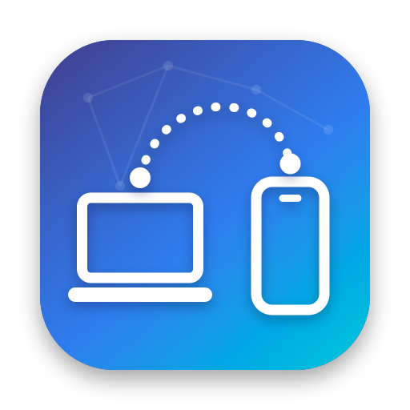
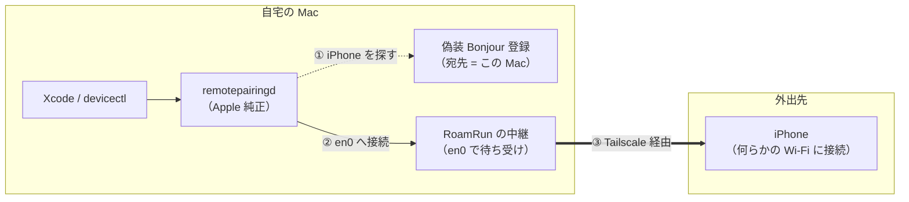
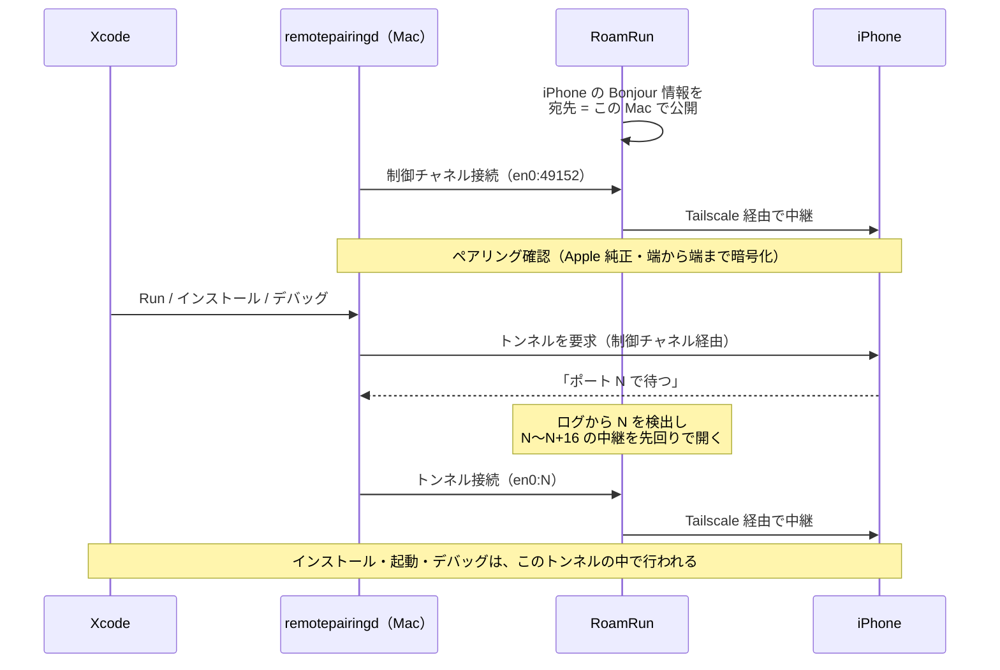

<p align="center">
  
</p>

<h1 align="center">RoamRun</h1>

<p align="center"><strong>Run your iOS apps wherever your device is.</strong></p>

Xcode のワイヤレスデバッグを、Tailscale などの mesh VPN 越しに使えるようにする macOS メニューバーアプリ。

iPhone が Mac と別の Wi-Fi ネットワークにいる状態でも、Xcode（`devicectl`/`remoted`）からはローカルにいるデバイスとして見え続けます。

## なぜ必要か

iOS 17+ のワイヤレスデバッグは CoreDevice スタック上で動き、デバイス発見は Bonjour/mDNS (`_remotepairing._tcp`) に依存しています。mDNS はリンクローカルマルチキャストなので、Tailscale のような L3 ユニキャスト VPN には乗りません。さらに Mac 側の `remotepairingd` は Bonjour で発見したインターフェースに接続をスコープするため、単に iPhone の tailnet IP を偽装広告しても接続は失敗します。

## 仕組み

ひとことで言うと、**Xcode には「iPhone は同じ Wi-Fi にいる」と見せかけ、実際の通信は Tailscale に流します。**



1. Xcode の裏で動く `remotepairingd` は、同じネットワークにいる iPhone を Bonjour（`_remotepairing._tcp`）で探します。RoamRun は、事前に取り込んだ iPhone の Bonjour 情報を「接続先はこの Mac 自身」として公開し直します。
2. `remotepairingd` は、その iPhone が同じ Wi-Fi にいると思って Mac 自身（en0）へ接続します。受けるのは RoamRun の中継です（この Mac 自身からの接続以外は拒否）。
3. 中継は通信を Tailscale 経由で iPhone に流します。中身（ペアリングの確認や暗号化）は Apple 純正の Mac⇄iPhone 間でそのまま行われ、RoamRun は読みも書き換えもしません。

接続の順序は次のとおりです。



- **トンネルのポートは毎回変わります**（1 つずつ増える）。`remotepairingd` は通知の約 5ms 後に接続してくるため、RoamRun はログ（`log stream`）でポートを見つけるたびに、その先 16 個まで中継を先回りで開けておきます。
- **ブリッジ起動直後の 1 回目**は、どうしても先回りが間に合いません。RoamRun は起動時に裏で `devicectl` を 1 回実行してこの 1 回目を消費し、利用者の最初の Run から成功するようにしています。

## 要件

- macOS 13+
- iPhone は iOS 17.4 以降（CoreDevice トンネルが TCP の世代。17.0–17.3 の QUIC/UDP トンネルは非対応）
- Xcode（devicectl が使えること）
- Tailscale（または任意の mesh VPN + 手動 IP 指定）が Mac/iPhone 両方で接続済み
- iPhone をこの Mac と一度ペアリング済み（USB、または Xcode 27 + iOS 27 なら同じ Wi-Fi 上で Device Hub の「+」→「Pair Nearby Device…」）、デベロッパモード ON
- ブリッジ中も iPhone は**何らかの Wi-Fi に接続していること**（cellular 不可: remotepairingd は Wi-Fi association を前提に listen する）

## インストール

### ソースからビルド（推奨）

```sh
git clone https://github.com/mh-mobile/RoamRun && cd RoamRun
make run     # ビルドして起動（アドホック署名）
```

Xcode プロジェクト不要。SwiftPM + Makefile で `.app` を組み立てます。手元でビルドしたアプリはダウンロード扱いにならないため、Gatekeeper の警告は出ません。常用するなら `RoamRun.app` を `/Applications` に移してください。

### ビルド済み dmg（GitHub Releases）

Releases の dmg は**アドホック署名のみ（公証なし）**です。初回起動時に macOS に止められるので、次のどちらかで許可してください:

- 一度開こうとした後、**システム設定 → プライバシーとセキュリティ → 「このまま開く」**
- または `xattr -dr com.apple.quarantine /Applications/RoamRun.app`

dmg は `make dmg` で作れます（`SIGN_ID` / `NOTARY_PROFILE` を渡すと Developer ID 署名と公証も行います。Makefile 参照）。

## 使い方

1. iPhone を USB または同一 Wi-Fi に接続した状態でメニューバーアイコン → Open RoamRun → Add iPhone
2. 一覧から iPhone を選び、Tailscale 上の同じデバイス（または手動 IP）を紐付け
3. iPhone を**別の Wi-Fi** に移してから Start Bridge
   - 同一 LAN にいる間は衝突防止のためブリッジを拒否します
4. Xcode の Devices ウインドウでデバイスが見え続け、ビルド・インストール・デバッグが可能

Mac の IP が変わるとブリッジは自動再起動します。

## CLI

アプリ本体がそのまま CLI にもなります（SSH 先の Mac やスクリプト向け）。

```sh
make install-cli              # /usr/local/bin/roamrun にリンク（BINDIR=~/bin なども可）
                              # dmg 版はアプリの Settings → Command line tool → Install…

roamrun devices               # 登録済み iPhone（名前・UDID）と状態
roamrun up <name>             # ブリッジを起動し、Ready まで表示。Ctrl-C で停止・後片付け
roamrun up <name> -d          # バックグラウンドで起動（ターミナルを閉じても継続。ログは ~/Library/Logs/RoamRun/）
roamrun status <name>         # Ready なら exit 0（スクリプトの待ち合わせ用）
roamrun down <name>           # ブリッジを停止（アプリ側・別ターミナルの up どちらでも）
roamrun doctor                # Mac → Tailscale → iPhone を順に診断し、直し方を表示
```

`<name>` は iPhone 本体の名前ではなく、**RoamRun に登録した名前**です（大文字小文字は区別しません。`roamrun devices` で確認、アプリの詳細画面の ✏️ で変更可。名前は重複できません）。iPhone の登録（Add iPhone）はアプリで一度だけ行ってください。アプリと CLI が同じ iPhone を同時にブリッジしないよう、後から起動した側は起動を拒否します。

## AI エージェントから使う

Claude Code・Codex・Cursor などのエージェントに、ビルド〜実機インストール〜デバッグを任せられます。エージェントに使い方を教えるスキルを入れてください:

```sh
roamrun init                                  # 入っているエージェントを検出してスキルを配置
# または
npx skills add mh-mobile/RoamRun             # skills CLI 経由
```

スキルには手順（`roamrun up -d` → `status --wait --json` で UDID 取得 → `xcodebuild` / `devicectl`）と、「iPhone のロック解除など人間にしかできないこと」が書かれています。CLI は `--json` と終了コード（0 準備完了 / 1 未準備・失敗 / 2 使い方の誤り）に対応しています。

## 外出先で iPhone だけで使う

Mac を自宅に置いたまま、手元の iPhone だけでビルド〜実機確認を回す使い方です。

**前提: iPhone は何らかの Wi-Fi に接続していること。** モバイル回線だけでは使えません（iPhone の RemotePairing が Wi-Fi 接続時しか待ち受けないため）。カフェやホテルの Wi-Fi、ポケット Wi-Fi、別の端末のテザリングなどを使ってください。

iPhone から Mac を操作する方法は 3 つあります。どの方法でも、テスト中のアプリと操作用のアプリを同じ iPhone 上で切り替えながら使います（アプリがバックグラウンドに回っても接続は切れません）。

| 方法 | iPhone 側 | 向いている用途 |
|---|---|---|
| **AI エージェントに任せる（おすすめ）** | スマホから自宅 Mac のエージェントを操作する機能（Claude Code の [Remote Control](https://code.claude.com/docs/en/remote-control.md)、ChatGPT アプリ経由の [Codex](https://learn.chatgpt.com/docs/remote-connections) など） | 「ビルドして iPhone で動かして」と頼み、手元で確認して指摘する反復 |
| SSH でターミナル操作 | SSH クライアント（Blink Shell、Termius など）+ Tailscale。tmux でセッションを維持すると、どのエージェントも同様に使える | `roamrun` / `xcodebuild` / `devicectl` / `lldb` を直接使う |
| Mac の画面を遠隔操作 | 画面共有・VNC クライアント + Tailscale | Xcode の Run やブレークポイントを GUI で使う |

例: Claude Code なら、自宅 Mac で `claude --remote-control`（または `claude remote-control`）を起動しておき、iPhone の Claude アプリの「Code」から接続します。Mac 側のプロセスが動いている間だけ操作できます。エージェントに RoamRun のスキル（`roamrun init`）を入れておくと、「iPhone のロックを解除して」などの依頼も流れの中で伝えてくれます。

なお、これらの遠隔操作機能では、会話内容が各サービスのサーバーを経由・保存されます（会社支給の Mac では社内規定を確認してください）。

手に持って使っている間は画面がついているため、iPhone のスリープによる切断は起きにくくなります。置いたまま待つ場合は、自動ロックを長めにしてください。

## 構成

| ファイル | 役割 |
|---|---|
| `BonjourCapture.swift` | `dns-sd -Z` ゾーンダンプの解析（PTR/SRV/TXT/A） |
| `DNSServiceProxy.swift` | `dns-sd -P` 子プロセスによる偽装広告 + 孤児掃除 |
| `Relays.swift` | NWListener/NWConnection の TCP バイトリレー（この Mac 自身からの接続のみ受理） |
| `TunnelPortWatcher.swift` | `log stream` でトンネルポート動的検出 |
| `InterfaceMonitor.swift` | en0 IP 変化の検知（getifaddrs + NWPathMonitor） |
| `ReachabilityProbe.swift` | 制御チャネルの TCP 到達確認 |
| `ProxyBridge.swift` | 上記のオーケストレーション（1デバイス=1インスタンス） |
| `TailscaleClient.swift` | `tailscale status --json` の解析 |
| `AppCoordinator.swift` | プロファイル管理・ブリッジ制御・プレゼンスチェック |

## Mac に作るもの・アンインストール

RoamRun が書き込むのは次の場所だけです（システム設定や他のアプリには触れません）。

| 場所 | 内容 |
|---|---|
| `~/Library/Application Support/RoamRun/` | 登録した iPhone（`profiles.json`）とブリッジの状態 |
| `~/Library/Logs/RoamRun/` | `roamrun up -d` のログ |
| `com.roamrun.app`（defaults） | 設定・前回動いていたブリッジ |
| `/usr/local/bin/roamrun` | CLI を入れた場合のみ（既存のファイルや他のツールのリンクは上書きしません） |
| `~/.claude/skills/roamrun/` など | `roamrun init` を実行した場合のみ（既存の他のスキルやリンクには触れません） |

ブリッジ中に起動する補助プロセス（`dns-sd` / `log stream`）は、RoamRun が強制終了しても 1 秒以内に自動で終了し、LAN への広告も消えます。

完全に削除するには:

```sh
roamrun init --uninstall                  # スキルを入れた場合
rm /usr/local/bin/roamrun                 # CLI を入れた場合
rm -rf ~/Library/Application\ Support/RoamRun ~/Library/Logs/RoamRun
defaults delete com.roamrun.app
# 最後に RoamRun.app を削除（「ログイン時に開く」を有効にしていた場合は先に無効化）
```

## 制限・既知の課題

- **Apple の非公開プロトコルに依存しています。** iOS 17 以降の CoreDevice / RemotePairing（Bonjour `_remotepairing._tcp` → 制御チャネル → トンネル）の挙動を前提にしており、将来の iOS / macOS / Xcode で動かなくなる可能性があります。困ったらまず `roamrun doctor` を実行してください。
- iPhone は**何らかの Wi-Fi に接続**している必要があります（テザリング可、セルラーのみは不可: remotepairingd が Wi-Fi 接続時しか待ち受けないため）
- iOS の Tailscale は、スリープやネットワーク切り替えの後に「MagicSock function ReceiveIPv4 is not running」と表示して通信が止まることがあります（接続中の表示のまま）。VPN をオフ → オンにし、Tailscale アプリは最新に保ってください
- iPhone がスリープすると Tailscale（VPN 拡張）も休止し、外から届かなくなります。デバッグ中は iPhone のロックを解除し、画面をつけたままにしてください（自動ロックを長めに）
- remotepairingd は約 42 秒ごとに制御チャネルを張り直します（Mac 自身の IP への ARP 確認が通らないため）。トンネルは約 0.4 秒で自動復旧し、デバッグセッションは継続します
- Tailscale が DERP 中継経由だと動作しますが遅くなります（`roamrun doctor` で経路を確認できます）
- iPhone 再起動後など、DDI の再ステージングで一度 USB 接続が必要な場合があります
- TXT の authTag/identifier が変わった場合は、同じ Wi-Fi で iPhone を追加し直してください
- ブリッジ中は、**この Mac が属するローカルネットワーク**（Wi-Fi・有線など mDNS が有効な全インターフェース）に iPhone の Bonjour 識別子（identifier / authTag）を広告し続けます。iPhone 本体と違い値が固定のため、同じネットワークの第三者に端末の存在を追跡される可能性があります（Mac を自宅に置いて使う通常の構成では問題になりません）。中継は、この Mac 自身から以外の接続を即座に切断します。iPhone 側の通信は Tailscale で暗号化されるため、iPhone がどの Wi-Fi にいても影響しません
- 開発しない期間は、iPhone のデベロッパモードをオフにする、または不要なペアリングを解除すると安全です（Apple の推奨）
- iPhone の RemotePairing のポートには、tailnet の他のメンバーからも到達できます（接続はできても、ペアリングの確認で弾かれます）。共有の tailnet では、Tailscale の Grants / ACL で iPhone に届く相手を自分の Mac に絞ることをおすすめします
- 同じネットワークに別の Mac がいると、その Mac の Xcode にもこの iPhone が一瞬表示されることがあります（接続は中継が拒否するため、操作や通信はできません）

## 参考

この実装は以下の公開情報をベースにしています:

- Kevin Paterson, ["How to remotely iterate & deploy your sideloaded iOS-apps over tailnet"](https://dev.to/kvnpt/how-to-remotely-iterate-deploy-your-sideloaded-ios-apps-over-tailnet-jak) (DEV Community) — `dns-sd -P` + `socat` による同等構成の実証

## 関連プロジェクト

同じ課題（別ネットワークの iPhone に Xcode から届かせる）に取り組んでいるプロジェクトです。

- [Viaaaron/iphone-tailnet-bridge](https://github.com/Viaaaron/iphone-tailnet-bridge) — Bonjour と socat による中継をシェルスクリプトで実装
- [ahmadtawakol/iphone-tailnet-bridge](https://github.com/ahmadtawakol/iphone-tailnet-bridge) — 上記のフォーク。ネイティブ macOS アプリと Go 製ツールを追加
- [CodeEagle/remote-ios-deploy-skill](https://github.com/CodeEagle/remote-ios-deploy-skill) — 同じ手法（Bonjour プロキシ + TCP/UDP 中継）をエージェント用スキル（SKILL.md）にしたもの
- [lyo-eos/ios-ota](https://github.com/lyo-eos/ios-ota) — Tailscale 越しに署名済みアプリをインストール（Wi-Fi から 5G への切り替え後も継続）。Xcode の Run やデバッガではなく、インストールに特化
