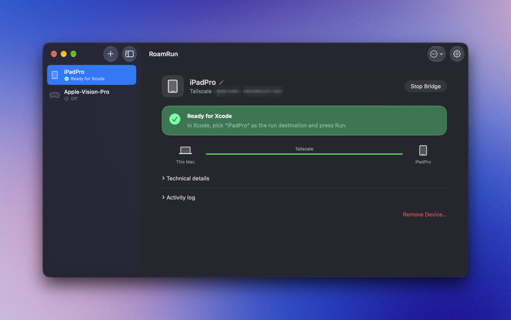
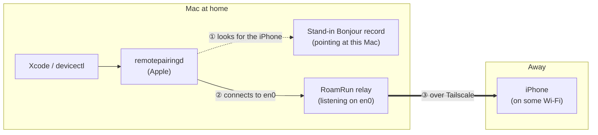
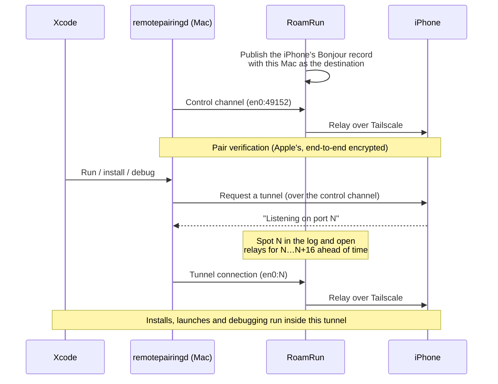
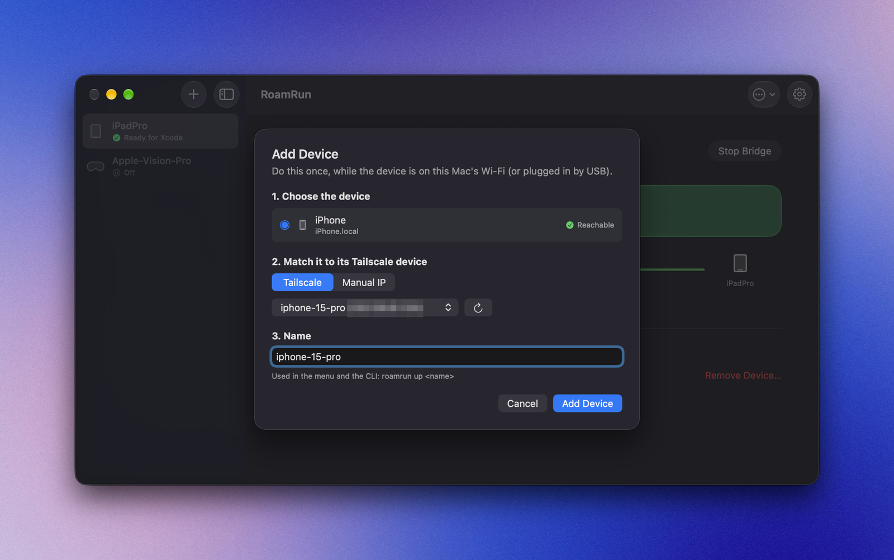
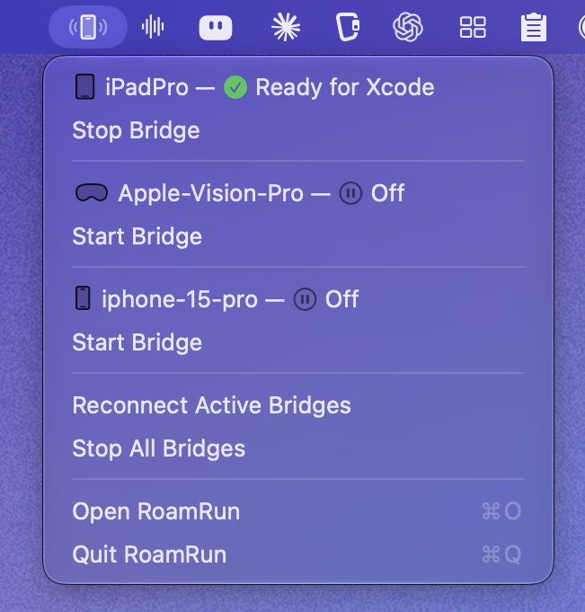

<p align="center">
  
</p>

<h1 align="center">RoamRun</h1>

<p align="center"><strong>Run your iOS apps wherever your device is.</strong></p>

<p align="center">
  <a href="https://github.com/mh-mobile/RoamRun/actions/workflows/ci.yml"></a>
  <a href="LICENSE"></a>
  
</p>

<p align="center">English | <a href="README.ja.md">日本語</a></p>

<p align="center"></p>

A macOS menu bar app that makes Xcode's wireless debugging work over Tailscale or another mesh VPN.

Even when the iPhone is on a different Wi-Fi network from the Mac, Xcode (`devicectl`/`remoted`) keeps seeing it as a local device.

## Why

Since iOS 17, wireless debugging runs on the CoreDevice stack, and devices are discovered with Bonjour/mDNS (`_remotepairing._tcp`). mDNS is link-local multicast, so it doesn't travel over a layer-3 unicast VPN like Tailscale. On top of that, the Mac's `remotepairingd` scopes its connection to the interface it discovered the device on, so simply advertising the iPhone's tailnet IP doesn't work either.

## How it works

In short: **Xcode is told the iPhone is on the same Wi-Fi, and the traffic actually goes over Tailscale.**



1. `remotepairingd`, which runs behind Xcode, looks for iPhones on the local network with Bonjour (`_remotepairing._tcp`). RoamRun re-publishes the iPhone's Bonjour record, captured beforehand, with this Mac itself as the destination.
2. Believing the iPhone is on the same Wi-Fi, `remotepairingd` connects to the Mac itself (en0). RoamRun's relay takes the connection (and refuses any that don't come from this Mac).
3. The relay forwards the traffic to the iPhone over Tailscale. Pairing verification and encryption happen end to end between the Mac and the iPhone exactly as Apple implements them; RoamRun neither reads nor modifies the traffic.

The connection sequence:



- **The tunnel port changes every time** (it goes up by one). `remotepairingd` connects about 5 ms after announcing it, so each time RoamRun sees a port in the log (`log stream`) it opens relays for the next 16 ports in advance.
- **The very first tunnel after a bridge starts** can't be caught in time. RoamRun runs `devicectl` in the background at startup to use up that first tunnel, so your first Run already succeeds.

## Requirements

- macOS 13+ on Apple Silicon (Intel Macs aren't supported), with an **administrator account** (RoamRun reads remotepairingd's log with `log stream`, which macOS only allows admins)
- iOS 17.4 or later on the iPhone (the generation whose CoreDevice tunnel is TCP; the QUIC/UDP tunnel of 17.0–17.3 isn't supported)
- Also verified with iPad and Apple Vision Pro, which work the same way ("iPhone" below includes them). Vision Pro has no USB and is developed for over Wi-Fi anyway, which makes it a natural fit for working away from the Mac
- Xcode (`devicectl` must be available)
- Tailscale (or any mesh VPN with a manually entered IP), connected on both the Mac and the iPhone
- The iPhone paired with this Mac once (over USB, or with Xcode 27 + iOS 27 on the same Wi-Fi via Device Hub › "+" › "Pair Nearby Device…"), with Developer Mode on
- While bridged, the iPhone must be **connected to some Wi-Fi network** (cellular alone won't do: remotepairingd only listens while the iPhone is on Wi-Fi)

## Install

### Homebrew (recommended)

```sh
brew install --cask mh-mobile/tap/roamrun
```

Installs `RoamRun.app` in `/Applications` and links the `roamrun` command. RoamRun isn't notarized, so macOS blocks it on first launch (not after `brew upgrade`): try to open it once, then **System Settings → Privacy & Security → "Open Anyway"**.

### Build from source

```sh
git clone https://github.com/mh-mobile/RoamRun && cd RoamRun
```

- **Try it:** `make run` — builds and launches `RoamRun.app` in the repo folder (quit an installed RoamRun first: only one runs at a time).
- **Everyday use:** `make app`, move `RoamRun.app` to `/Applications`, open it, and install the CLI from the app (see [CLI](#cli)).
- **Developing RoamRun:** `make install-cli` links `roamrun` to the build in the repo folder, so each `make app` takes effect right away. If you later move the app, reinstall the CLI from the app.

No Xcode project needed: SwiftPM and a Makefile assemble the `.app`. An app you build yourself isn't treated as a download, so Gatekeeper won't warn.

### Prebuilt dmg (GitHub Releases)

The dmg on Releases is **ad-hoc signed only (not notarized)**. macOS blocks it on first launch; allow it in either way:

- After trying to open it once, **System Settings → Privacy & Security → "Open Anyway"**
- Or `xattr -dr com.apple.quarantine /Applications/RoamRun.app`

The first screen offers to install the `roamrun` command.

Build the dmg with `make dmg` (pass `SIGN_ID` / `NOTARY_PROFILE` to sign with a Developer ID and notarize; see the Makefile).

### Updating

There's no auto-update. With Homebrew, `brew upgrade --cask roamrun` (it quits RoamRun first). Otherwise quit RoamRun, replace `/Applications/RoamRun.app` with the new version (from source: `git pull` and `make app` first), and open it. Saved devices and the CLI link stay as they are, and bridges that were running start again. A new dmg is blocked on first launch like the first install: allow it again with "Open Anyway".

## Usage

1. With the iPhone on USB or the same Wi-Fi: menu bar icon → Open RoamRun → Add Device
2. Pick the iPhone from the list and match it to the same device on Tailscale (or enter an IP manually)
3. Start Bridge
   - While the iPhone is on the Mac's Wi-Fi, the bridge stands aside as "On this Wi‑Fi" (Xcode reaches the iPhone directly); once the iPhone moves to another network, the bridge starts by itself
4. The device stays visible in Xcode's Devices window, ready to build, install and debug

When the Mac's IP changes, the bridge restarts automatically.

<p align="center">
  
  
</p>

## CLI

The app binary doubles as a CLI (handy over SSH or in scripts). To put `roamrun` on your PATH (`/usr/local/bin/roamrun`):

- **Homebrew:** already linked (`/opt/homebrew/bin/roamrun` on Apple Silicon).
- **dmg:** click "Also install the roamrun command for Terminal…" on the first screen, or Open RoamRun → ⚙ Settings → Command line tool → **Install…**
- **Built from source:** the same, once the app is in `/Applications`; or `make install-cli` to use the build in the repo folder (`BINDIR=$HOME/bin` also works)

```sh
roamrun devices               # saved devices (name, UDID) and their status
roamrun up <name>             # start a bridge and show progress until Ready; Ctrl-C stops and cleans up
roamrun up <name> -d          # start in the background (survives closing the terminal; log in ~/Library/Logs/RoamRun/)
roamrun status <name>         # exits 0 when Ready (for waiting in scripts; without a name: when any device is)
roamrun down <name>           # stop a bridge, whether the app or another terminal's `up` runs it
roamrun doctor                # check Mac → Tailscale → iPhone step by step and say how to fix
roamrun run <name> [--scheme S] [--logs]   # in the project folder: build → install → launch (--scheme: only if it has several; --logs: stream output; like Xcode, it may create provisioning profiles)
roamrun install <name> <App.ipa|App.app>   # install a build signed for the device (checks the signing first)
roamrun logs <name> <bundle-id>   # relaunch the app and stream its print / os_log output (Ctrl-C to stop)
roamrun screenshot <name> [file.png]   # save the device's screen as PNG and print the path (Xcode 27)
```

Options: `--json` (`devices`, `status`, `doctor`), `--wait N` (`status`: wait up to N seconds for Ready), `-v` (`up`: show the activity log), `--workspace W` / `--project P` / `--configuration C` (`run`). `roamrun --help` lists everything; a command rejects options it doesn't take (exit 2).

`<name>` is **the name you gave the device in RoamRun**, not the iPhone's own name (case-insensitive; see `roamrun devices`, rename with ✏️ in the app's detail view; names must be unique). Add each device once in the app (Add Device). The app and the CLI never bridge the same iPhone at once: whichever starts second refuses (`up` exits 0 if the other one already has it ready), except that a bridge that is standing aside ("On this Wi‑Fi") or has an error can be taken over. `logs` relaunches the app, since `devicectl` can't attach a console to one already running; it works over a bridge and on the same Wi-Fi alike.

`install` takes an `.ipa` (e.g. from CI) or an `.app` exported for **Debugging, Release Testing (Ad Hoc) or Enterprise** — the device's UDID must be in its provisioning profile (Enterprise: any device that trusts the certificate). Builds for App Store Connect (App Store / TestFlight) can't be installed directly; `install` says so before trying. RoamRun only reaches devices paired with this Mac; to hand a build to devices that aren't, use TestFlight or over-the-air distribution (Ad Hoc / Enterprise).

### Other tools over the bridge

While the bridge is Ready, Xcode's command-line tools reach the device as if it were on this Wi-Fi. Verified so far:

```sh
xcrun devicectl device capture screenshot --device <udid> --destination shot.png   # what `roamrun screenshot` runs
xcrun devicectl device process launch --device <udid> <bundle-id>
xcodebuild test -destination id=<udid> …                                           # UI tests (XCUITest) run on the device
xcrun devicectl device info files --device <udid> --domain-type appDataContainer --domain-identifier <bundle-id>   # list an app's files
xcrun devicectl device copy from --device <udid> --domain-type appDataContainer --domain-identifier <bundle-id> --source <path> --destination <local path>   # pull one (copy to: push)
xcrun devicectl device info files --device <udid> --domain-type systemCrashLogs     # crash logs (.ips); copy them the same way
```

`roamrun status <name>` shows the UDID. UI tests also mean XCUITest-based drivers run on a device that is away, so tools that let an AI agent read and tap the screen work over the bridge too (tried: WebDriverAgent — reached at the device's Tailscale address, about 2 s per tap over tethering; agent-device — works, but its many round trips made each action take 25–35 s, and taps missed a windowed iPad app). Expect them to be slower than on the same Wi-Fi. More tools are being checked ([issues](https://github.com/mh-mobile/RoamRun/issues): Instruments, …).

## Using it from an AI agent

Claude Code, Codex, Cursor and other agents can take over building, installing on the device and debugging. Install the skill that teaches them how:

```sh
roamrun init                                  # detect installed agents and add the skill
# or
npx skills add mh-mobile/RoamRun             # via the skills CLI
```

The skill describes the steps (`roamrun up -d` → `status --wait 60 --json` for the UDID → `xcodebuild` / `devicectl`) and what only a human can do, such as unlocking the iPhone. The CLI supports `--json` and exit codes (0 ready / 1 not ready or failed / 2 usage error).

## Working from just your iPhone, away from home

Leave the Mac at home and run the whole build-and-try loop from the iPhone in your hand.

**Prerequisite: the iPhone must be on a Wi-Fi network with internet access.** Cellular alone doesn't work (the iPhone's RemotePairing only listens while on Wi-Fi). Joining a Wi-Fi network marked "No Internet Connection" and sending traffic over cellular doesn't work either — we tested it. Use café or hotel Wi-Fi, a pocket Wi-Fi router, or tethering from another device.

**About the network path:** Tailscale normally connects the Mac and the iPhone directly (`tailscale status` shows `direct <address>` on the iPhone's line). On public Wi-Fi that blocks UDP and similar networks, traffic goes through Tailscale's relay servers (DERP; shown as `relay "tok"` etc.). That works, but it's slower. On Wi-Fi with a sign-in page, sign in first. Verified over cellular tethering (about 80 ms latency, direct): installing, launching, and debugging from Xcode with breakpoints.

There are three ways to drive the Mac from the iPhone. In each case you switch between the app under test and the control app on the same iPhone (moving an app to the background doesn't drop the connection).

| Method | On the iPhone | Best for |
|---|---|---|
| **Let an AI agent do it (recommended)** | Features for driving an agent on your home Mac from your phone (Claude Code's [Remote Control](https://code.claude.com/docs/en/remote-control.md), [Codex](https://learn.chatgpt.com/docs/remote-connections) via the ChatGPT app, and so on) | Ask "build it and run it on my iPhone", check the result in your hand, give feedback, repeat |
| Terminal over SSH | An SSH client (Blink Shell, Termius, …) + Tailscale. Keep the session in tmux and any agent works the same way | Using `roamrun` / `xcodebuild` / `devicectl` / `lldb` directly |
| Remote control of the Mac's screen | Screen Sharing / a VNC client + Tailscale | Xcode's Run and breakpoints in the GUI |

Example: with Claude Code, start `claude --remote-control` (or `claude remote-control`) on the Mac at home and connect from "Code" in the Claude app on the iPhone. You can drive it only while the Mac-side process is running. With RoamRun's skill installed in the agent (`roamrun init`), requests like "please unlock the iPhone" come up naturally as part of the flow.

Note that these remote features route conversations through, and store them on, each service's servers (check your company's policy on a work Mac).

While the iPhone is in your hand its screen stays on, so it rarely drops off because of sleep. If you leave it waiting, set Auto-Lock to a longer time.

## Source layout

Main files in `Sources/RoamRun/`:

| File | Role |
|---|---|
| `BonjourCapture.swift` | Parses the `dns-sd -Z` zone dump (PTR/SRV/TXT/A) |
| `DNSServiceProxy.swift` | Stand-in advertisement through a `dns-sd -P` child process, plus orphan cleanup |
| `Relays.swift` | TCP byte relay on NWListener/NWConnection (accepts connections from this Mac only) |
| `TunnelPortWatcher.swift` | Detects tunnel ports from `log stream` and attributes them to their device |
| `InterfaceMonitor.swift` | Picks the LAN interface (en0 unless set in Settings) and notices its IP changes (getifaddrs + NWPathMonitor) |
| `ReachabilityProbe.swift` | TCP reachability and the RemotePairing handshake check |
| `ProxyBridge.swift` | Orchestrates the above (one instance per device) |
| `TailscaleClient.swift` | Parses `tailscale status --json` and `tailscale ping` |
| `AppCoordinator.swift` | Profiles, bridge control, presence checks |
| `StatusFile.swift` | Bridge status shared by the app and the CLI (who owns which device) |
| `CLI.swift` | The `roamrun` command (same binary as the app) |

## What it creates on your Mac, and uninstalling

RoamRun writes only to these places (it never touches system settings or other apps):

| Location | Contents |
|---|---|
| `~/Library/Application Support/RoamRun/` | Saved devices (`profiles.json`) and bridge status |
| `~/Library/Logs/RoamRun/` | Logs of `roamrun up -d` |
| `com.roamrun.app` (defaults) | Settings and which bridges were running |
| `/usr/local/bin/roamrun` | Only if you installed the CLI from the app or `make install-cli` (never overwrites an existing file or another tool's link); Homebrew links `/opt/homebrew/bin/roamrun` instead |
| `~/.claude/skills/roamrun/` etc. | Only if you ran `roamrun init` (never touches other skills or links) |

The helper processes started while bridging (`dns-sd` / `log stream`) exit within a second even if RoamRun is force-quit, and the LAN advertisement goes away with them.

First stop bridges started with `roamrun up -d` (`roamrun down <name>`): they keep running without the app. With Homebrew, `brew uninstall --zap --cask roamrun` then removes the app, the CLI link, settings and logs (skills: `roamrun init --uninstall` first). Otherwise, to remove everything:

```sh
roamrun init --uninstall                  # if you installed the skill (with npx: npx skills remove roamrun)
rm /usr/local/bin/roamrun                 # if you installed the CLI
rm -rf ~/Library/Application\ Support/RoamRun ~/Library/Logs/RoamRun
defaults delete com.roamrun.app
# finally delete /Applications/RoamRun.app (turn off "Open at login" first if you enabled it)
```

## Limitations and known issues

- **It depends on Apple's private protocols.** It assumes how CoreDevice / RemotePairing behave since iOS 17 (Bonjour `_remotepairing._tcp` → control channel → tunnel), and future iOS / macOS / Xcode versions may break it. When in trouble, run `roamrun doctor` first.
- The bridge listens on **en0** (Wi-Fi on most Macs). If this Mac reaches its LAN through another interface (e.g. Ethernet on a Mac mini), pick it in Open RoamRun › ⚙ Settings › Network
- The iPhone must be **connected to some Wi-Fi network** (tethering is fine, cellular alone is not: remotepairingd only listens while on Wi-Fi)
- After sleep or a network change, Tailscale on iOS sometimes shows "MagicSock function ReceiveIPv4 is not running" and stops passing traffic while still looking connected. Turn the VPN off and on, and keep the Tailscale app up to date
- When the iPhone sleeps, Tailscale (a VPN extension) pauses too and the iPhone becomes unreachable. While debugging, keep the iPhone unlocked with its screen on (set a longer Auto-Lock)
- remotepairingd rebuilds the control channel about every 42 seconds (its ARP check on the Mac's own IP fails). The tunnel recovers in about 0.4 seconds and the debug session carries on
- Through Tailscale's relay servers (DERP) it works, but more slowly (`roamrun doctor` shows the path)
- Away from home, **running with the debugger (⌘R) takes a while**. Attaching lldb takes hundreds of round trips, so latency and packet loss add up directly. The number of round trips grows with the number of frameworks loaded, and install time is roughly proportional to the app's size (measured with a ~600 KB app over tethering at about 25–60 ms latency: about 1 minute with the debugger, about 4 seconds without; transfer rate 0.4–0.9 MB/s). When you don't need breakpoints, turn off "Debug executable" under Edit Scheme › Run › Info; when you do, turning off "Queue Debugging" (Options) and "Main Thread Checker" / "Thread Performance Checker" (Diagnostics) speeds it up
- After the iPhone restarts, re-staging the DDI may need one USB connection
- If the TXT record's authTag/identifier changes, add the iPhone again on the same Wi-Fi
- While bridging, RoamRun keeps advertising the iPhone's Bonjour identifiers (identifier / authTag) on **every local network this Mac is on** (Wi-Fi, Ethernet — every interface with mDNS). Unlike the iPhone's own advertisement these values are fixed, so someone on the same network could track the device's presence — also on networks a laptop Mac joins while bridging (a café's, a hotel's). Someone there can also replay the record to make the bridge stand aside for a while; it can't use the device. The relay immediately drops any connection that doesn't come from this Mac. The iPhone's side is encrypted by Tailscale, so whichever Wi-Fi it's on doesn't matter
- **Tested with Xcode and `devicectl`.** Flutter and React Native build and install through the same tools, so they should work while the bridge is Ready, but this hasn't been verified yet ([#5](https://github.com/mh-mobile/RoamRun/issues/5)). `roamrun run` builds the Xcode project in the current folder (for those, `cd ios` first)
- When you're not developing, turning off the iPhone's Developer Mode or removing pairings you don't need is safer (Apple's recommendation)
- Other members of your tailnet can reach the iPhone's RemotePairing port too (they can connect, but pair verification rejects them). On a shared tailnet, use Tailscale Grants / ACLs so only your Mac can reach the iPhone
- If another Mac is on the same network, this iPhone may briefly show up in that Mac's Xcode as well (the relay refuses its connections, so it can't do anything with it)

## Security

What RoamRun exposes and how, and how to report a vulnerability: [SECURITY.md](SECURITY.md).

## Credits

This implementation builds on the following public write-up:

- Kevin Paterson, ["How to remotely iterate & deploy your sideloaded iOS-apps over tailnet"](https://dev.to/kvnpt/how-to-remotely-iterate-deploy-your-sideloaded-ios-apps-over-tailnet-jak) (DEV Community) — demonstrates an equivalent setup with `dns-sd -P` + `socat`

## Related projects

Projects tackling the same problem (reaching an iPhone on another network from Xcode):

- [Viaaaron/iphone-tailnet-bridge](https://github.com/Viaaaron/iphone-tailnet-bridge) — Bonjour plus a socat relay, as shell scripts
- [ahmadtawakol/iphone-tailnet-bridge](https://github.com/ahmadtawakol/iphone-tailnet-bridge) — a fork of the above that adds a native macOS app and Go tools
- [CodeEagle/remote-ios-deploy-skill](https://github.com/CodeEagle/remote-ios-deploy-skill) — the same approach (Bonjour proxy + TCP/UDP relay) as an agent skill (SKILL.md)
- [lyo-eos/ios-ota](https://github.com/lyo-eos/ios-ota) — installs signed apps over Tailscale (and keeps going when switching from Wi-Fi to 5G). Focused on installing rather than Xcode's Run or the debugger

## License

[MIT](LICENSE)
