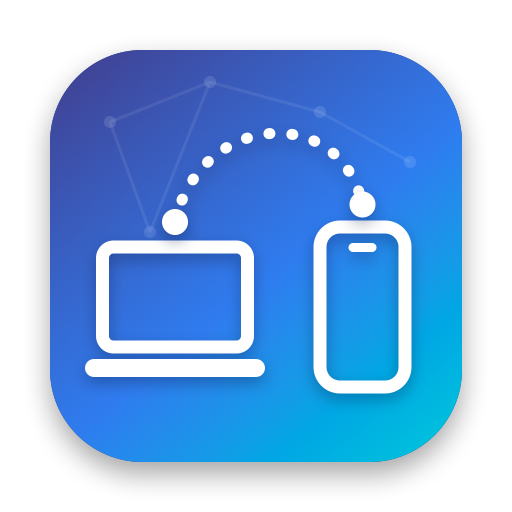
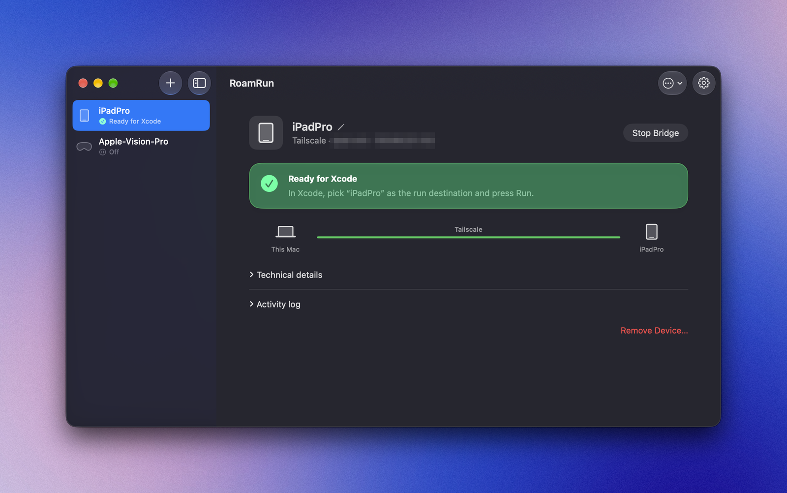
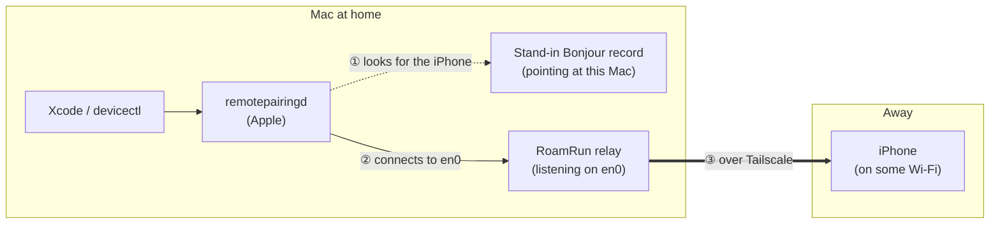
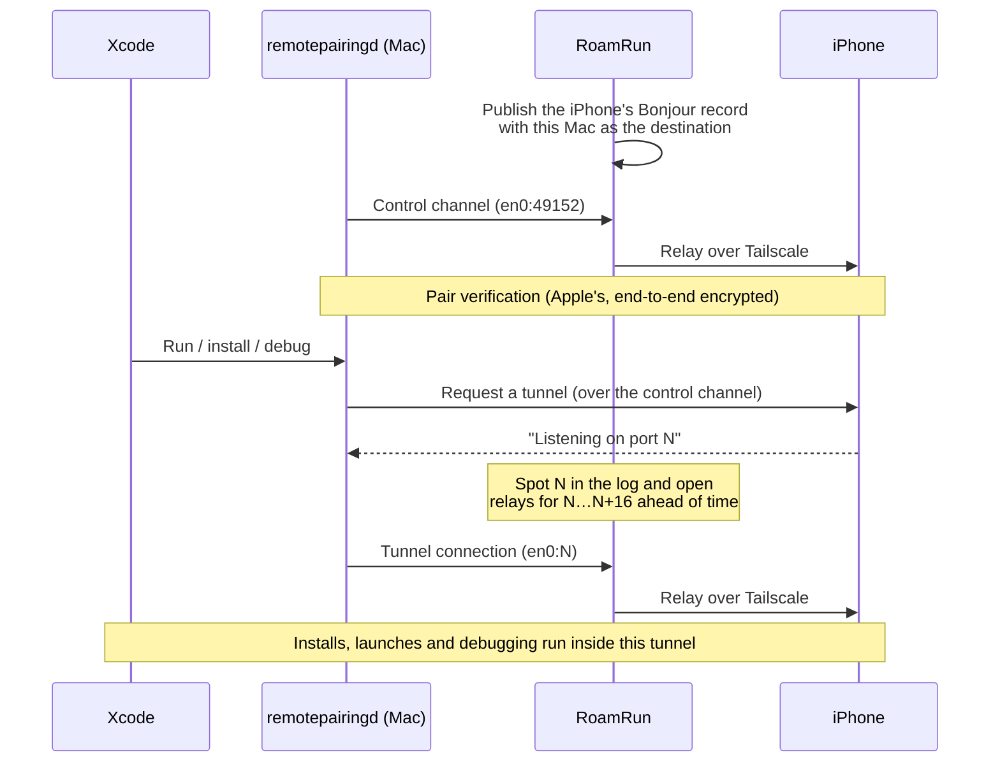
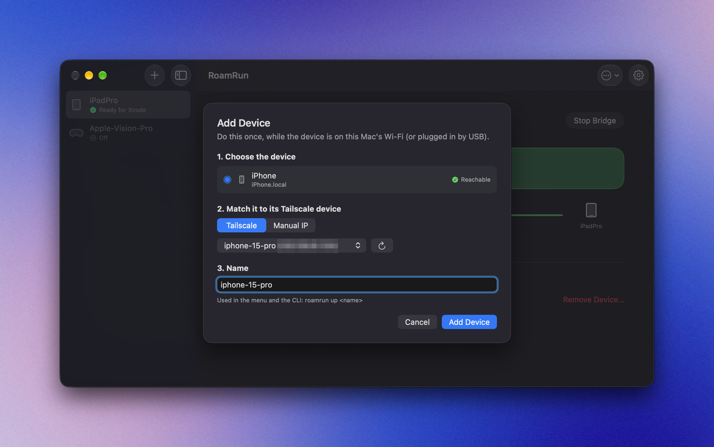
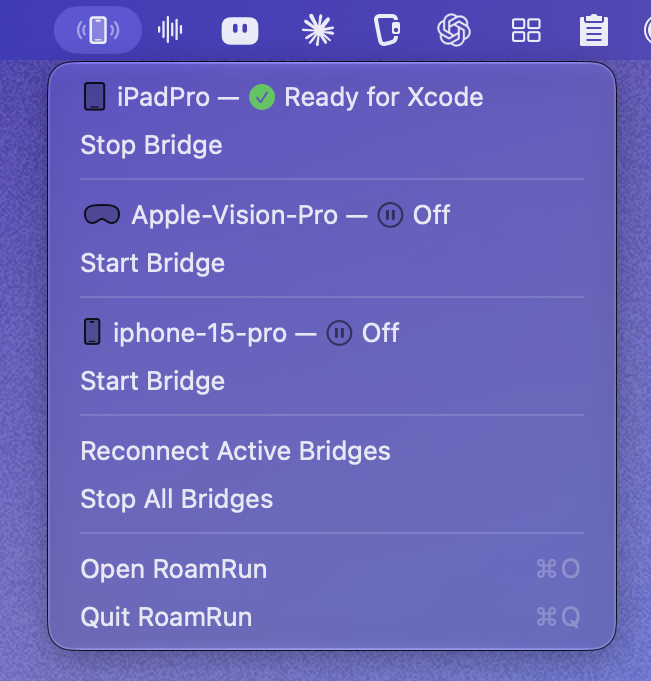

<p align="center">
  
</p>

<h1 align="center">RoamRun</h1>

<p align="center"><strong>Run your iOS apps wherever your device is.</strong></p>

<p align="center">
  <a href="https://github.com/mh-mobile/RoamRun/actions/workflows/ci.yml"></a>
  <a href="LICENSE"></a>
  
</p>

<p align="center"><a href="https://mh-mobile.github.io/RoamRun/">Website</a> · English | <a href="README.ja.md">日本語</a></p>

<p align="center"></p>

A macOS menu bar app that makes Xcode's wireless debugging work over Tailscale or another mesh VPN.

Even when the iPhone is on a different Wi-Fi network from the Mac, Xcode (`devicectl`/`remoted`) keeps seeing it as a local device.

## Why

Since iOS 17, wireless debugging runs on the CoreDevice stack, and devices are discovered with Bonjour/mDNS (`_remotepairing._tcp`). mDNS is link-local multicast, so it doesn't travel over a layer-3 unicast VPN like Tailscale. On top of that, the Mac's `remotepairingd` scopes its connection to the interface it discovered the device on, so simply advertising the iPhone's tailnet IP doesn't work either.

## How it works

In short: **Xcode is told the iPhone is on the same Wi-Fi, and the traffic actually goes over Tailscale.**


```mermaid
flowchart LR
  subgraph mac["Mac at home"]
    xcode["Xcode / devicectl"] --> rpd["remotepairingd<br/>(Apple)"]
    fake["Stand-in Bonjour record<br/>(pointing at this Mac)"]
    relay["RoamRun relay<br/>(listening on en0)"]
  end
  subgraph away["Away"]
    iphone["iPhone<br/>(on some Wi-Fi)"]
  end
  rpd -. "① looks for the iPhone" .-> fake
  rpd -- "② connects to en0" --> relay
  relay == "③ over Tailscale" ==> iphone
```

1. `remotepairingd`, which runs behind Xcode, looks for iPhones on the local network with Bonjour (`_remotepairing._tcp`). RoamRun re-publishes the iPhone's Bonjour record, captured beforehand, with this Mac itself as the destination.
2. Believing the iPhone is on the same Wi-Fi, `remotepairingd` connects to the Mac itself (en0). RoamRun's relay takes the connection (and refuses any that don't come from this Mac).
3. The relay forwards the traffic to the iPhone over Tailscale. Pairing verification and encryption happen end to end between the Mac and the iPhone exactly as Apple implements them; RoamRun neither reads nor modifies the traffic.

The connection sequence:


```mermaid
sequenceDiagram
  participant X as Xcode
  participant R as remotepairingd (Mac)
  participant B as RoamRun
  participant P as iPhone
  B->>B: Publish the iPhone's Bonjour record<br/>with this Mac as the destination
  R->>B: Control channel (en0:49152)
  B->>P: Relay over Tailscale
  Note over R,P: Pair verification (Apple's, end-to-end encrypted)
  X->>R: Run / install / debug
  R->>P: Request a tunnel (over the control channel)
  P-->>R: "Listening on port N"
  Note over B: Spot N in the log and open<br/>relays for N…N+16 ahead of time
  R->>B: Tunnel connection (en0:N)
  B->>P: Relay over Tailscale
  Note over X,P: Installs, launches and debugging run inside this tunnel
```

- **The tunnel port changes every time** (it goes up by one). `remotepairingd` connects about 5 ms after announcing it, so each time RoamRun sees a port in the log (`log stream`) it opens relays for the next 16 ports in advance.
- **The very first tunnel after a bridge starts** can't be caught in time. RoamRun runs `devicectl` in the background at startup to use up that first tunnel, so your first Run already succeeds.

## Requirements

- macOS 13+ on Apple Silicon (Intel Macs aren't supported), with an **administrator account** (RoamRun reads remotepairingd's log with `log stream`, which macOS only allows admins)
- iOS 17.4 or later on the iPhone (the generation whose CoreDevice tunnel is TCP; the QUIC/UDP tunnel of 17.0–17.3 isn't supported)
- Also verified with iPad and Apple Vision Pro, which work the same way ("iPhone" below includes them). Vision Pro has no USB and is developed for over Wi-Fi anyway, which makes it a natural fit for working away from the Mac
- Xcode with `devicectl` (Xcode 15 or later) whose Device Support range covers the iPhone's iOS, and that runs on your macOS — both are in [Apple's table](https://developer.apple.com/support/xcode/). Building your app may need a newer SDK, depending on the APIs it uses; that is your project's requirement, not RoamRun's. `roamrun logs` and `run --logs` need Xcode 16 or later, where `devicectl` gained `--console`
- Tailscale (or any mesh VPN with a manually entered IP), connected on both the Mac and the iPhone
- The iPhone paired with this Mac once (over USB, or with Xcode 27 + iOS 27 on the same Wi-Fi via Device Hub › "+" › "Pair Nearby Device…"), with Developer Mode on
- To connect, the iPhone must be **on some Wi-Fi network** (cellular alone won't do: remotepairingd only listens while the iPhone is on Wi-Fi). Once it shows **Ready for Xcode** (bridged from another Wi‑Fi), it can move to cellular and keep the session Xcode has, if you turn on Settings › Network › **Keep debugging on cellular** (off by default: every Run then uses the iPhone's data)

## Install

### Homebrew (recommended)

```sh
brew install --cask mh-mobile/tap/roamrun
```

Installs `RoamRun.app` in `/Applications` and links the `roamrun` command. RoamRun is signed with a Developer ID and notarized by Apple (from 0.1.12), so it opens like any other app.

### Build from source

```sh
git clone https://github.com/mh-mobile/RoamRun && cd RoamRun
```

- **Try it:** `make run` — builds and launches `RoamRun.app` in the repo folder (quit an installed RoamRun first: only one runs at a time).
- **Everyday use:** `make app`, move `RoamRun.app` to `/Applications`, open it, and install the CLI from the app (see [CLI](#cli)).
- **Developing RoamRun:** `make install-cli` links `roamrun` to the build in the repo folder, so each `make app` takes effect right away. If you later move the app, reinstall the CLI from the app.

Needs Xcode and Rust by [rustup](https://rustup.rs) (for device control's library; `make` builds it, with the Rust version it names). No Xcode project needed: SwiftPM and a Makefile assemble the `.app`. An app you build yourself isn't treated as a download, so Gatekeeper won't warn.

### Prebuilt dmg (GitHub Releases)

The dmg on Releases is **signed with a Developer ID and notarized by Apple** (from 0.1.12): drag RoamRun to Applications and open it. (Up to 0.1.11 it was only ad-hoc signed and needed System Settings → Privacy & Security → "Open Anyway" on first launch.)

The first screen offers to install the `roamrun` command.

Build the dmg with `make dmg` (pass `SIGN_ID` / `NOTARY_PROFILE` to sign with a Developer ID and notarize; see the Makefile).

### Updating

Release notes: <https://github.com/mh-mobile/RoamRun/releases>. There's no auto-update. With Homebrew, `brew upgrade --cask roamrun` (it quits RoamRun first). Otherwise quit RoamRun, replace `/Applications/RoamRun.app` with the new version (from source: `git pull` and `make app` first), and open it. Saved devices and the CLI link stay as they are, and bridges that were running start again.

## Usage

1. With the iPhone on USB or the same Wi-Fi: menu bar icon → Open RoamRun → Add Device
2. Pick the iPhone from the list and match it to the same device on Tailscale (or enter an IP manually)
3. Start Bridge
   - While the iPhone is on the Mac's Wi-Fi, the bridge stands aside as "On this Wi‑Fi" (Xcode reaches the iPhone directly); once the iPhone moves to another network, the bridge starts by itself
4. The device stays visible in Xcode's Devices window, ready to build, install and debug

When the Mac's IP changes, the bridge restarts automatically.

<p align="center">
  
  
</p>

## CLI

The app binary doubles as a CLI (handy over SSH or in scripts). To put `roamrun` on your PATH (`/usr/local/bin/roamrun`):

- **Homebrew:** already linked (`/opt/homebrew/bin/roamrun` on Apple Silicon).
- **dmg:** click "Also install the roamrun command for Terminal…" on the first screen, or Open RoamRun → ⚙ Settings → Command line tool → **Install…**
- **Built from source:** the same, once the app is in `/Applications`; or `make install-cli` to use the build in the repo folder (`BINDIR=$HOME/bin` also works)

```sh
roamrun devices               # saved devices (name, UDID, id) and their status
roamrun up <name>             # start a bridge and show progress until Ready; Ctrl-C stops and cleans up
roamrun up <name> -d          # start in the background (survives closing the terminal; log in ~/Library/Logs/RoamRun/)
                              #   waits up to 60s for Ready (or On this Wi‑Fi) and exits 1 if not — the bridge keeps trying unless it exits with an error retrying can't fix (see the log)
roamrun status <name>         # exits 0 when Xcode can use the device (Ready, or On this Wi‑Fi and reachable; without a name: when any device is)
roamrun down <name>           # stop a bridge, whether the app or another terminal's `up` runs it
roamrun doctor                # check Mac → Tailscale → iPhone step by step and say how to fix
roamrun run <name> [--scheme S] [--logs]   # in the project folder: build → install → launch (--scheme: only if it has several; --logs: stream output; like Xcode, it may create provisioning profiles)
roamrun install <name> <App.ipa|App.app>   # install a build signed for the device (checks the signing first)
roamrun logs <name> <bundle-id>   # relaunch the app and stream its print / os_log output (Ctrl-C to stop)
# run and logs also take launch options, e.g. to open one screen before a screenshot:
#   --arg A (one per word, repeatable; may start with "-")   --env NAME=value (repeatable)   --url myapp://settings
roamrun screenshot <name> [file.png]   # save the device's screen as PNG and print the path (Xcode 26.3+; earlier untested)
roamrun ota [<name>] <App.ipa> [--replace] # publish the build so a device can install it itself, without the
                                           #   bridge — install only, needs Ad Hoc or Enterprise signing (see below)
```

Options: `--json` (`devices`, `status`, `doctor`; `devices` doesn't ask CoreDevice, so its `ready` only means the bridge is Ready or the device is on this Wi‑Fi — `status` also asks CoreDevice once the device's UDID is known), `--wait N` (`status`: wait up to N seconds for Ready; each round runs one `devicectl list devices`, plus a lock check per ready device, before the deadline is looked at again, so it can return several seconds after N; each of those calls is also cut to the time left, between 5 and 10 seconds), `-v` (`up`: show the activity log), `--workspace W` / `--project P` / `--configuration C` (`run`), `--replace` (`ota`: drop builds already listed under the same version and build number). `roamrun --help` lists everything; a command rejects options it doesn't take (exit 2).

The CLI uses the app's settings, so a bridge started with `roamrun up` follows **Keep debugging on cellular** too. Without access to the app's Settings (over SSH, for example), turn it on or off with `defaults`:

```bash
defaults write io.github.mh-mobile.roamrun keepDebuggingOnCellular -bool true    # false to turn it off again
```

`<name>` is **the name you gave the device in RoamRun**, not the iPhone's own name (case-insensitive; see `roamrun devices`, rename with ✏️ in the app's detail view; names must be unique). Add each device once in the app (Add Device). The app and the CLI never bridge the same iPhone at once: whichever starts second refuses (`up` exits 0 if the other one already has it ready), except that a bridge that is standing aside ("On this Wi‑Fi") or has an error can be taken over — by Start, not by the app's automatic retries: while a `roamrun up` runs, the app leaves its device to it, and a second `roamrun up` for that device doesn't start (exit 0 if the first is standing aside, 1 otherwise). `logs` relaunches the app, since `devicectl` can't attach a console to one already running; it works over a bridge and on the same Wi-Fi alike.

`install` takes an `.ipa` (e.g. from CI) or an `.app` exported for **Debugging, Release Testing (Ad Hoc) or Enterprise** — the device's UDID must be in its provisioning profile (Enterprise: any device that trusts the certificate). Builds for App Store Connect (App Store / TestFlight) can't be installed directly; `install` says so before trying. RoamRun only reaches devices paired with this Mac; to hand a build to devices that aren't, use TestFlight or over-the-air distribution (Ad Hoc / Enterprise).

### Other tools over the bridge

While the bridge is Ready, Xcode's command-line tools reach the device as if it were on this Wi-Fi. Verified so far:

```sh
xcrun devicectl device capture screenshot --device <udid> --destination shot.png   # what `roamrun screenshot` runs
xcrun devicectl device process launch --device <udid> <bundle-id>
xcodebuild test -destination id=<udid> …                                           # UI tests (XCUITest) run on the device
xcrun devicectl device info files --device <udid> --domain-type appDataContainer --domain-identifier <bundle-id>   # list an app's files
xcrun devicectl device copy from --device <udid> --domain-type appDataContainer --domain-identifier <bundle-id> --source <path> --destination <local path>   # pull one (copy to: push)
xcrun devicectl device pasteboard copy --file image.png --type public.png --device <udid>   # onto the device's clipboard — no app needed (paste reads it back)
xcrun devicectl device info files --device <udid> --domain-type systemCrashLogs     # crash logs (.ips); copy them the same way
```

`roamrun status <name>` shows the UDID. UI tests also mean XCUITest-based drivers run on a device that is away, so tools that let an AI agent read and tap the screen work over the bridge too (tried: WebDriverAgent — reached at the device's Tailscale address, about 2 s per tap over tethering; agent-device — works, but its many round trips made each action take 25–35 s, and taps missed a windowed iPad app). Expect them to be slower than on the same Wi-Fi. More tools are being checked ([issues](https://github.com/mh-mobile/RoamRun/issues): Instruments, …).

## Using it from an AI agent

Claude Code, Codex, Cursor and other agents can take over building, installing on the device and debugging. Install the skill that teaches them how:

```sh
roamrun init                                  # add the skill to every agent found in ~ (.claude, .codex, .cursor, .gemini, .copilot)
roamrun init --client claude                  # or only to the ones you name (repeat --client)
```

`init` installs the skill shipped with your RoamRun, so it always matches the CLI. After updating RoamRun, run `roamrun init` again — `roamrun status` and `doctor` remind you when an installed skill is from another version. If you manage skills with another tool instead, pin it to your RoamRun's release so skill and CLI agree, e.g. `gh skill install mh-mobile/RoamRun roamrun --pin "v$(roamrun --version | cut -d" " -f2)"` (the repo's main branch may describe options your installed version doesn't have yet).

The skill covers getting the device connected (`roamrun up -d` → `status --wait 60 --json` for the UDID), what only a human can do, such as unlocking the iPhone, and screenshots; building and launching are left to the agent's usual tools, with `roamrun run` as a one-command fallback. The CLI supports `--json` and exit codes (0 ready / 1 not ready or failed / 2 usage error); `status` without a device name lists every saved device and exits 0 if any one of them is ready, so name the device when a script needs the answer to be about that one.

## Seeing and operating the device

RoamRun can also show the device's screen and operate it — tap, swipe, type, press its buttons — from the command line or as tools for an AI agent. It needs **iOS / iPadOS 27 or later** (earlier versions refuse remote control), and it doesn't go through the bridge or Xcode: RoamRun makes a pairing and a connection of its own.

**Set up, once per device**, with the device on the same Wi‑Fi as the Mac: open the device's page in RoamRun → **Device control › Set Up…**. On the device, under Settings › Privacy & Security › Developer Mode, pick RoamRun and enter the code the Mac shows. After that it connects whenever the device is on a Wi‑Fi and reachable over the VPN, and stays connected when the device moves to cellular. The RoamRun app holds the connection, so it has to be running.

```sh
roamrun look iPhone /tmp/now.png          # the screen now, as PNG; prints the path, then its size
roamrun tap iPhone 590 1280               # a point in the pixels of that image
roamrun swipe iPhone 590 1800 590 900     # drag from one point to another
roamrun type iPhone "hello"               # US keys; right only while the device's keyboard is an English one
roamrun paste iPhone "任意の文字列"         # any text, by the device's pasteboard (iOS asks "Allow Paste")
roamrun press iPhone home                 # home, lock, volume-up, volume-down
roamrun elements iPhone                   # what accessibility says is on the screen (no positions)
```

Each `look` serves one action: look, act, look again. For an agent, the same are MCP tools: `claude mcp add roamrun -- roamrun mcp`, or the like for another agent; the skill (`roamrun init`) tells it how to use them.

These press what is really on the screen, and a `look` shows whatever is there — notifications and messages too. The device lists each connection as a screen-sharing session, and RoamRun's pairing under Developer Mode, where you can remove it. The pairing holds a private key; how it is kept, and who can use it, is in [SECURITY.md](SECURITY.md).

## Installing without the bridge: over the air

The bridge needs the device on Wi-Fi — `remotepairingd` only listens there — and
paired with this Mac. An over-the-air install needs neither: it is the device
fetching a file over HTTPS, which the mesh VPN carries over Wi-Fi and cellular
alike.

So this is the way in when the bridge isn't available or isn't the right tool:

- **No Wi-Fi to join** — out for a walk, phone on cellular. There is no bridge at
  all then, and this is the only thing that still works.
- **A device that was never paired with this Mac**, and never has to be.
  Someone else's phone, one you borrowed for an afternoon.
- **The build you actually ship.** `roamrun run` installs a Development build;
  this takes the Ad Hoc archive, which is the signing your testers will get.
- **Someone else on your tailnet.** They open the page and install — no Mac, no
  Xcode, no cable at their end.

When the bridge *is* available, prefer it: it gives you the debugger, `roamrun
logs` and `roamrun screenshot`, wants no paid account, and puts nothing on your
tailnet.

```sh
roamrun ota build/MyApp.ipa            # checks it against every device RoamRun knows
roamrun ota iPhone build/MyApp.ipa     # or name one, to check just that device
```

It prints which of your devices the build covers — an Ad Hoc profile only names
some of them, and the page offers the build to all of them at once.

RoamRun keeps the build, and while the app runs it publishes a page through
`tailscale serve`. Open the address it prints (or point the camera at the QR
code it draws) on the device and tap Install. The page can take half a minute
to appear after the app starts, and `roamrun doctor` prints the address again if
you lose it. The page lists the last 5 builds
of each app, newest first, so you can also go back a version when the one you
just installed turns out to be broken.

Rebuilds usually keep the same version number, so builds stack up under it and
the time tells them apart; handing over the very same .ipa twice doesn't add a
second row (it moves back to the top instead — asking for it again is what going
back to it means). Pass `--replace` when a build supersedes what is already listed
under its version and you'd rather keep one row per version and build number.

What you give up: this is **install only**. No debugger, no `roamrun logs`, no
`roamrun screenshot` — none of that exists without the bridge. Use it to try a
build, not to work on one.

What it needs:

- A **paid Apple Developer account**. Neither Ad Hoc nor Enterprise signing
  exists on a free one, and iOS installs neither a Development build nor an
  unsigned one this way.
- An **.ipa signed for Release Testing (Ad Hoc) or Enterprise**. Xcode makes one
  with Product › Archive › Distribute App › Release Testing (`xcodebuild
  -exportArchive` with `"method": "release-testing"` does the same from a script). `roamrun run` can't make one — it signs for
  Development, which only installs through the bridge, and `roamrun ota` refuses
  it rather than letting iOS fail cryptically. Ad Hoc also means the device has to
  be in the provisioning profile. RoamRun says which of your devices it names —
  it knows the UDID of every device it has bridged, so bridge one once
  (`roamrun up <name> -d`) and Xcode registers it like any local device while
  RoamRun learns its UDID. A build that names none of them is still stored, with a
  warning: the page is open to your whole tailnet, and the profile may name a
  device this Mac has never seen. Enterprise signing needs none of this.
- **HTTPS in your tailnet** — MagicDNS and HTTPS certificates turned on. RoamRun
  serves on a port of its own (41443 by default, `defaults write
  io.github.mh-mobile.roamrun otaPort -int …` to change it; 443, 8443 and 10000
  are refused and fall back to 41443, since Funnel could publish those, and so
  are ports below 1024 and above 65535) and gives
  it back when it quits. It never touches your tailnet's `:443`, where whatever else you
  serve lives — and because Tailscale Funnel currently publishes only 443, 8443
  and 10000, a port outside those three can't be put on the internet. RoamRun
  never turns Funnel on, and says so loudly if it finds it on for that port
  anyway — that list is Tailscale's policy, not a promise.
- RoamRun **running**, since it is the app that serves the page.

**Anyone on your tailnet can open that page and install those builds.** On a
tailnet you share, restrict it with Tailscale Grants / ACLs.

One thing RoamRun can't check, because it happens on the device: an Ad Hoc build
needs **Developer Mode** on to *launch* on iOS 16 and later. Nothing is needed
from a Mac for that — the switch appears under Settings › Privacy & Security once
the app is installed, and the device restarts once. An Enterprise build doesn't
need it, but does need its developer trusted under Settings › General › VPN &
Device Management.

Two things that end with iOS refusing the install and no clue why, so RoamRun
checks them first: a **provisioning profile that has expired** (they last a
year, `roamrun ota` won't store a build past that date, and one that expires
after it was stored is marked EXPIRED on the page) and an **Ad Hoc
build that doesn't name this device**.

## Working from just your iPhone, away from home

Leave the Mac at home and run the whole build-and-try loop from the iPhone in your hand.

**Prerequisite: the iPhone must be on a Wi-Fi network with internet access.** Cellular alone doesn't work (the iPhone's RemotePairing only listens while on Wi-Fi). What does work: get to **Ready for Xcode** on some other Wi‑Fi, then move to cellular with **Keep debugging on cellular** on (Settings › Network). Only from Ready for Xcode: when the iPhone is "On this Wi‑Fi" (the Mac's own network), Xcode reaches it over the LAN, not through RoamRun, so leaving home straight onto cellular ends the session either way.

**Tip: to leave home without losing the session**, keep the iPhone off the Mac's own network even at home. Join a Wi‑Fi that another device makes: a travel router, or a spare phone or tablet sharing its connection. That device can itself be on your home Wi‑Fi, as long as it gives the iPhone a network of its own and doesn't just extend yours. RoamRun then shows **Ready for Xcode** instead of "On this Wi‑Fi", and Tailscale connects the two directly inside your home, so it stays fast. With Keep debugging on cellular on, walking out of range onto cellular keeps the session. Xcode keeps the session it has, and RoamRun shows "Ready for Xcode · Cellular". A new session needs Wi-Fi again, for example after the iPhone restarts or Tailscale drops. With the setting off, RoamRun closes the session when the iPhone leaves Wi-Fi ("Waiting for device · Cellular") and reconnects once it is back, however long it was away. If the iPhone restarts while on cellular and its RemotePairing port changes, it can't reconnect on its own: use Find RemotePairing Port in the app. Joining a Wi-Fi network marked "No Internet Connection" and sending traffic over cellular doesn't work either — we tested it. Use café or hotel Wi-Fi, a pocket Wi-Fi router, or tethering from another device (a second iPhone's Personal Hotspot works; the iPhone sharing its own hotspot doesn't, since it isn't on Wi-Fi itself).

**About the network path:** Tailscale normally connects the Mac and the iPhone directly (`tailscale status` shows `direct <address>` on the iPhone's line). On public Wi-Fi that blocks UDP and similar networks, traffic goes through Tailscale's relay servers (DERP; shown as `relay "tok"` etc.). That works, but it's slower. On Wi-Fi with a sign-in page, sign in first. Verified over cellular tethering (about 80 ms latency, direct): installing, launching, and debugging from Xcode with breakpoints.

There are three ways to drive the Mac from the iPhone. In each case you switch between the app under test and the control app on the same iPhone (moving an app to the background doesn't drop the connection).

| Method | On the iPhone | Best for |
|---|---|---|
| **Let an AI agent do it (recommended)** | Features for driving an agent on your home Mac from your phone (Claude Code's [Remote Control](https://code.claude.com/docs/en/remote-control.md), [Codex](https://learn.chatgpt.com/docs/remote-connections) via the ChatGPT app, and so on) | Ask "build it and run it on my iPhone", check the result in your hand, give feedback, repeat |
| Terminal over SSH | An SSH client (Blink Shell, Termius, …) + Tailscale. Keep the session in tmux and any agent works the same way | Using `roamrun` / `xcodebuild` / `devicectl` / `lldb` directly |
| Remote control of the Mac's screen | Screen Sharing / a VNC client + Tailscale | Xcode's Run and breakpoints in the GUI |

Example: with Claude Code, start `claude --remote-control` (or `claude remote-control`) on the Mac at home and connect from "Code" in the Claude app on the iPhone. You can drive it only while the Mac-side process is running. With RoamRun's skill installed in the agent (`roamrun init`), requests like "please unlock the iPhone" come up naturally as part of the flow.

Note that these remote features route conversations through, and store them on, each service's servers (check your company's policy on a work Mac).

While the iPhone is in your hand its screen stays on, so it rarely drops off because of sleep. If you leave it waiting, set Auto-Lock to a longer time.

## Source layout

Main files in `Sources/RoamRun/`:

| File | Role |
|---|---|
| `BonjourCapture.swift` | Parses the `dns-sd -Z` zone dump (PTR/SRV/TXT/A) |
| `DNSServiceProxy.swift` | Stand-in advertisement through a `dns-sd -P` child process, plus orphan cleanup |
| `Relays.swift` | TCP byte relay on NWListener/NWConnection (accepts connections from this Mac only) |
| `TunnelPortWatcher.swift` | Detects tunnel ports from `log stream` and attributes them to their device |
| `InterfaceMonitor.swift` | Picks the LAN interface (the one set in Settings; else en0, or the first other en* with an address when en0 has none) and notices its IP changes (getifaddrs + NWPathMonitor) |
| `ReachabilityProbe.swift` | TCP reachability and the RemotePairing handshake check |
| `ProxyBridge.swift` | Orchestrates the above (one instance per device) |
| `OTA.swift` | Builds kept for over-the-air installs: storage, signing checks, icons |
| `OTAPage.swift` | The install page and the `itms-services` manifest, made per request |
| `OTAServer.swift` | Loopback HTTP server `tailscale serve` puts behind HTTPS |
| `TailscaleClient.swift` | Parses `tailscale status --json` and `tailscale ping` |
| `AppCoordinator.swift` | Profiles, bridge control, presence checks |
| `StatusFile.swift` | Bridge status shared by the app and the CLI (who owns which device) |
| `CLI.swift` | The `roamrun` command (same binary as the app) |
| `DeviceControl.swift` | Device control: the connections the app holds, the pairing, and the socket the CLI and MCP tools ask through |
| `DeviceControlKey.swift` | The Keychain key the saved pairings are sealed with |
| `DeviceMCP.swift` | `roamrun mcp`: the same commands as MCP tools |

Device control's connection itself is in `Sources/DeviceControl/` (Swift) over `Rust/RoamRunDevice/` (RoamRun's C interface to the idevice crate).

## What it creates on your Mac, and uninstalling

RoamRun writes only to these places (it never touches system settings or other apps; `roamrun ota` also asks `tailscale serve` to carry one port, see below):

| Location | Contents |
|---|---|
| `~/Library/Application Support/RoamRun/` | Saved devices (`profiles.json`), bridge status, device control's socket (`control/`) and the name this Mac pairs under (`device-control-host`), and `ota/` — the last 5 builds per app kept for over-the-air installs (excluded from Time Machine; delete the folder to reclaim the space) |
| `~/Library/Logs/RoamRun/` | Logs of `roamrun up -d` |
| `io.github.mh-mobile.roamrun` (defaults; `com.roamrun.app` before 0.1.12) | Settings and which bridges were running |
| `/usr/local/bin/roamrun` | Only if you installed the CLI from the app or `make install-cli` (never overwrites an existing file or another tool's link); Homebrew links `/opt/homebrew/bin/roamrun` instead |
| `~/.claude/skills/roamrun/` etc. | Only if you ran `roamrun init` (never touches other skills or links) |
| Login Keychain: “RoamRun device control” | Only if you set up device control: the key its saved pairings (`device-pairing-<UDID>.sealed`, in the first folder) are sealed with |

If you used `roamrun ota`, one more thing lives outside that table: RoamRun asks
`tailscale serve` to carry one port — whichever `otaPort` names, 41443 by
default — and gives it back when it quits, but not if it is force-quit or
crashes. `tailscale serve --https=41443 --set-path=/ off` clears it, and so does opening
RoamRun again: it recognises a leftover of its own and gives it back. It looks on
the port configured now and on every port named by the last 5 distinct registrations it recorded, so a
leftover from before `otaPort` was changed is found too. Only one older than
that is missed.

**Quit RoamRun before uninstalling.** `brew uninstall --zap` deletes the settings
that record which entry was RoamRun's, so an entry left by an app that was never
asked to quit becomes one nothing can recognise afterwards. Quitting first, or
running the `off` command above, avoids it.

The helper processes started while bridging (`dns-sd` / `log stream`) typically exit within about a second even if RoamRun is force-quit, and the LAN advertisement goes away with them.

First stop bridges started with `roamrun up -d` (`roamrun down <name>`): they keep running without the app. With Homebrew, `brew uninstall --zap --cask roamrun` then removes the app, the CLI link, settings, logs and your saved devices (skills: `roamrun init --uninstall` first). Otherwise, to remove everything:

```sh
roamrun init --uninstall                  # if you installed the skill (with another tool: remove it there)
rm /usr/local/bin/roamrun                 # if you installed the CLI
rm -rf ~/Library/Application\ Support/RoamRun ~/Library/Logs/RoamRun
security delete-generic-password -s io.github.mh-mobile.roamrun.device-control   # if you set up device control (also after brew --zap)
tailscale serve --https=41443 --set-path=/ off   # if you used roamrun ota (the port otaPort names)
defaults delete io.github.mh-mobile.roamrun      # after the line above: it holds otaPort
defaults delete com.roamrun.app 2>/dev/null      # left by versions before 0.1.12
# finally delete /Applications/RoamRun.app (turn off "Open at login" first if you enabled it)
```

## Limitations and known issues

- **It depends on Apple's private protocols.** It assumes how CoreDevice / RemotePairing behave since iOS 17 (Bonjour `_remotepairing._tcp` → control channel → tunnel), and future iOS / macOS / Xcode versions may break it. When in trouble, run `roamrun doctor` first.
- **If macOS blocks RoamRun's local-network access, the device always looks "away".** Every probe to this Wi-Fi fails at once, so RoamRun goes on bridging (and advertising) a device sitting right next to it; over the mesh VPN everything else keeps working, so nothing else gives it away. From 0.1.14 RoamRun says so in the window, the activity log, `roamrun status` and `roamrun doctor`. Allow RoamRun in System Settings › Privacy & Security › Local Network. If the switch is already on, the permission is stuck and the app has to be reinstalled; the only way confirmed to clear it is `brew uninstall --zap --cask roamrun` then `brew install --cask mh-mobile/tap/roamrun`. **`--zap` also deletes your saved devices**, so copy `~/Library/Application Support/RoamRun/profiles.json` aside and put it back **before opening RoamRun again** — once open, it writes its own list over the file. (This came from changing the bundle id in 0.1.12; with the id and signature now fixed it shouldn't recur.) ([#23](https://github.com/mh-mobile/RoamRun/issues/23))
- The bridge listens on **en0** (Wi-Fi on most Macs), or another en* port when en0 has no address. If this Mac reaches its LAN through another interface (e.g. Ethernet on a Mac mini), pick it in Open RoamRun › ⚙ Settings › Network
- The iPhone must be **connected to some Wi-Fi network** to connect (another device's tethering is fine, cellular alone or the iPhone's own hotspot is not: remotepairingd only listens while on Wi-Fi). After that it can stay on cellular only from Ready for Xcode (not from On this Wi‑Fi), with Keep debugging on cellular turned on
- After sleep or a network change, Tailscale on iOS sometimes shows "MagicSock function ReceiveIPv4 is not running" and stops passing traffic while still looking connected. Turn the VPN off and on, and keep the Tailscale app up to date
- When the iPhone sleeps, Tailscale (a VPN extension) pauses too and the iPhone becomes unreachable. While debugging, keep the iPhone unlocked with its screen on (set a longer Auto-Lock)
- remotepairingd rebuilds the control channel about every 42 seconds (its ARP check on the Mac's own IP fails). The tunnel recovers in about 0.4 seconds and the debug session carries on
- Through Tailscale's relay servers (DERP) it works, but more slowly (`roamrun doctor` shows the path)
- Away from home, **running with the debugger (⌘R) takes a while**. Attaching lldb takes hundreds of round trips, so latency and packet loss add up directly. The number of round trips grows with the number of frameworks loaded, and install time is roughly proportional to the app's size (measured with a ~600 KB app over tethering at about 25–60 ms latency: about 1 minute with the debugger, about 4 seconds without; transfer rate 0.4–0.9 MB/s). When you don't need breakpoints, turn off "Debug executable" under Edit Scheme › Run › Info; when you do, turning off "Queue Debugging" (Options) and "Main Thread Checker" / "Thread Performance Checker" (Diagnostics) speeds it up
- After the iPhone restarts, re-staging the DDI may need one USB connection
- If the TXT record's authTag/identifier changes, add the iPhone again on the same Wi-Fi
- While bridging, RoamRun keeps advertising the iPhone's Bonjour identifiers (identifier / authTag) on **every local network this Mac is on** (Wi-Fi, Ethernet — every interface with mDNS). Unlike the iPhone's own advertisement these values are fixed, so someone on the same network could track the device's presence — also on networks a laptop Mac joins while bridging (a café's, a hotel's). Someone there can also replay the record to make the bridge stand aside for a while; it can't use the device. The relay immediately drops any connection that doesn't come from this Mac. The iPhone's side is encrypted by Tailscale, so whichever Wi-Fi it's on doesn't matter
- **Tested with Xcode and `devicectl`.** Flutter and React Native build and install through the same tools, so they should work while the bridge is Ready, but this hasn't been verified yet ([#5](https://github.com/mh-mobile/RoamRun/issues/5)). `roamrun run` builds the Xcode project in the current folder (for those, `cd ios` first)
- When you're not developing, turning off the iPhone's Developer Mode or removing pairings you don't need is safer (Apple's recommendation)
- Other members of your tailnet can reach the iPhone's RemotePairing port too (they can connect, but pair verification rejects them). On a shared tailnet, use Tailscale Grants / ACLs so only your Mac can reach the iPhone
- If another Mac is on the same network, this iPhone may briefly show up in that Mac's Xcode as well (the relay refuses its connections, so it can't do anything with it)

## Getting help

Something broken, or the docs unclear? Open an issue:
<https://github.com/mh-mobile/RoamRun/issues>. Please include `roamrun --version`,
your macOS / Xcode / iOS versions and the output of `roamrun doctor --json`.

## Security

What RoamRun exposes and how, and how to report a vulnerability: [SECURITY.md](SECURITY.md).

## Credits

This implementation builds on the following public write-up:

- Kevin Paterson, ["How to remotely iterate & deploy your sideloaded iOS-apps over tailnet"](https://dev.to/kvnpt/how-to-remotely-iterate-deploy-your-sideloaded-ios-apps-over-tailnet-jak) (DEV Community) — demonstrates an equivalent setup with `dns-sd -P` + `socat`

Device control is built on [idevice](https://github.com/jkcoxson/idevice) (Jackson Coxson), a Rust implementation of the protocols a Mac speaks to a device. The licenses of it and of the other crates RoamRun is built from are in [THIRD-PARTY-LICENSES.txt](THIRD-PARTY-LICENSES.txt), which the app carries too.

## Related projects

Projects tackling the same problem (reaching an iPhone on another network from Xcode):

- [Viaaaron/iphone-tailnet-bridge](https://github.com/Viaaaron/iphone-tailnet-bridge) — Bonjour plus a socat relay, as shell scripts
- [ahmadtawakol/iphone-tailnet-bridge](https://github.com/ahmadtawakol/iphone-tailnet-bridge) — a fork of the above that adds a native macOS app and Go tools
- [CodeEagle/remote-ios-deploy-skill](https://github.com/CodeEagle/remote-ios-deploy-skill) — the same approach (Bonjour proxy + TCP/UDP relay) as an agent skill (SKILL.md)
- [lyo-eos/ios-ota](https://github.com/lyo-eos/ios-ota) — installs signed apps over Tailscale (and keeps going when switching from Wi-Fi to 5G). Focused on installing rather than Xcode's Run or the debugger

## License

[MIT](LICENSE)
