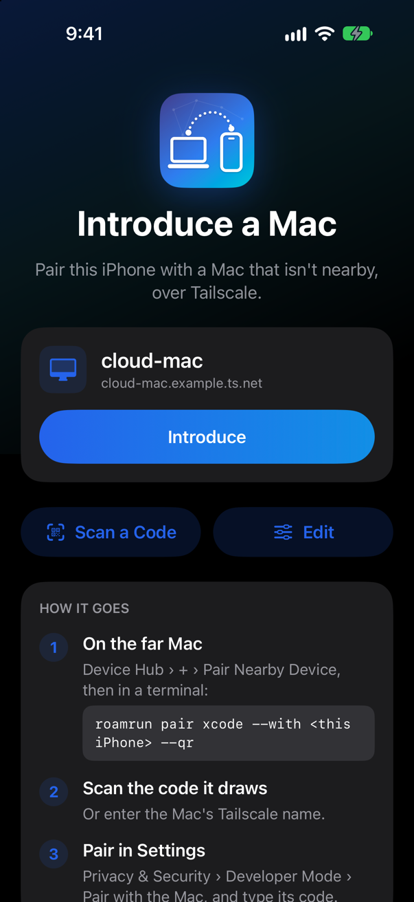
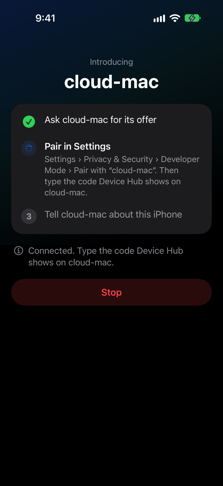
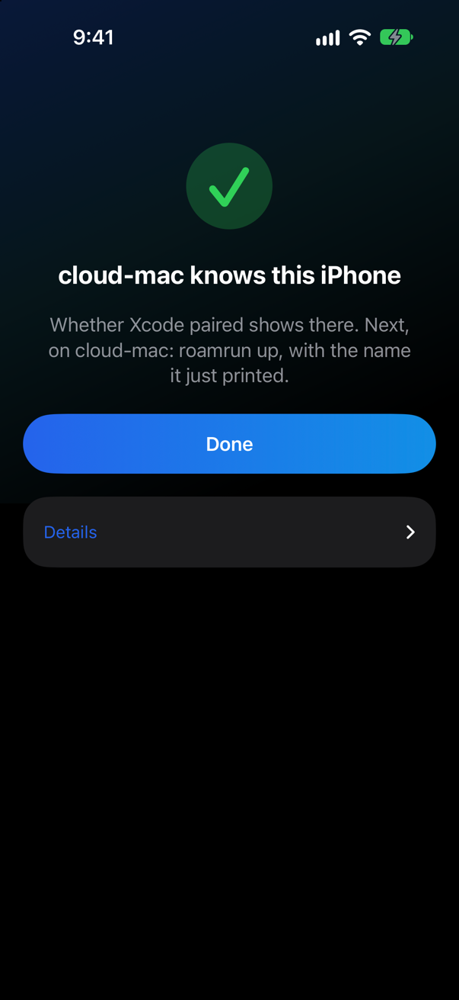
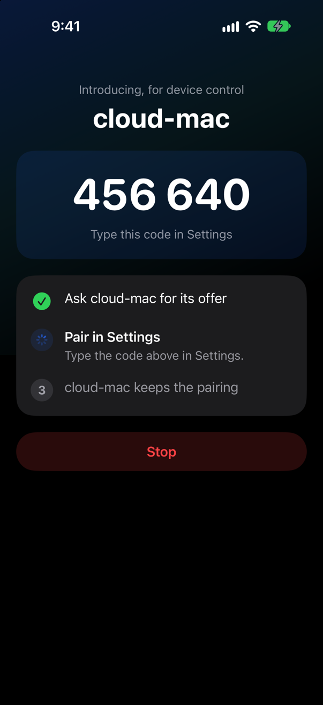
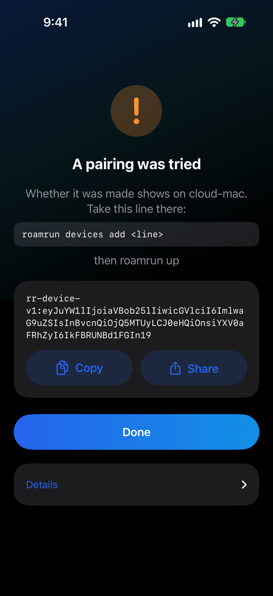

# RoamRun Introducer

<p align="center">English | <a href="README.ja.md">日本語</a></p>

An iOS app that stands in for `roamrun pair introduce` on the device itself: it announces a far
Mac's pairing offer on the device's own Wi-Fi, takes the one connection Settings makes to it, and
carries it to the far Mac over the Tailscale VPN already on the device. No Mac near the device is
needed. How it is used from the far Mac: the main README, "From the device itself".

<p align="center">
  
  
  
</p>

It isn't part of `make app`, and isn't on the App Store: build it here. On the Home Screen and in Settings it is “RoamRun”: the whole name doesn't fit under an icon. `Sources/Introduction.swift`
mirrors `Sources/RoamRun/Introductions.swift` (the line formats and their rules); keep them identical.

It needs iOS 27 or later: what it stands in for is a Mac waiting in Device Hub's Pair Nearby Device, which Xcode 27 makes for devices on iOS 27 and later (its release notes, under Device Hub).

## Build and run on a device

```
cd iOS
xcodegen generate
open RoamRunIntroducer.xcodeproj   # set your team under Signing, run on the iPhone
```

It takes a Mac with Xcode 27 and [XcodeGen](https://github.com/yonaskolb/XcodeGen) (`brew install xcodegen`), once: the
app then needs no Mac near the device. Signed with a free personal team it runs for seven days and is installed again;
with a paid one, a year. Its own version stays 0.1: what matters is the far Mac's RoamRun, 0.5.0 or later.

Or from the shell: `xcodebuild -project RoamRunIntroducer.xcodeproj -scheme RoamRunIntroducer -destination 'generic/platform=iOS' CODE_SIGNING_ALLOWED=NO build`.
No entitlements, no background modes: Local Network permission and `BGContinuedProcessingTask` carry it.

## Flow

No line is carried by hand: the app speaks the introducing side of `roamrun pair xcode --with`.

1. On the far Mac: Xcode › Device Hub › Pair Nearby Device, then `roamrun pair xcode --with <this iPhone's Tailscale name>`
   (RoamRun 0.5.0 or later: earlier ones take only a Mac after `--with`).
2. In the app: the far Mac's Tailscale name (typed once, kept). Tap **Introduce**; allow Local Network when asked.
   With `--qr` after `--with`, the far Mac draws a code in its terminal: the app's **Scan a Code**, or the iPhone's camera, opens the app with that
   name filled in (`roamrun-introducer://<far Mac's Tailscale name>`), and nothing is typed.
3. Settings › Privacy & Security › Developer Mode › Pair with “<far Mac>”, type the code Device Hub shows on the far Mac.
4. The app tells the far Mac, which saves this iPhone under its Tailscale name. There: `roamrun up`.

Device control (`look`, `tap`…) is paired the same way, with the RoamRun app open on the far Mac and
`roamrun pair control --with <this iPhone's Tailscale name>` there (`--qr` here too, for a far Mac the app
doesn't hold the name of): the app needs no other setting — the far Mac's
answer says which pairing it is. The code is made on the far Mac and shown here, in a notification and where iOS
shows the app's background task, over Settings.

<p align="center">
  
  
</p>

**Carry the lines by hand** is the way without `--with` (the `rr-xcode-offer-v1:` line from `roamrun pair xcode`, pasted —
or read with the far Mac's name from the code `roamrun pair xcode --qr` draws —
copy the `rr-device-v1:` line the app shows to `roamrun devices add`), for a far Mac that can't be asked. The app
also shows that line when the far Mac didn't say whether it saved.

The far Mac's name and this iPhone's Tailscale name are kept between launches. The offer line isn't: it
only works while its Pair Nearby Device sheet is open on the far Mac, and each press makes another.

If the app says it could not see this iPhone's own announcement, check `roamrun devices` on the far
Mac first. An existing record can be used with `roamrun up <name>`. Otherwise, a Mac that already
has this iPhone saved can run `roamrun devices export <name>`; add that line on the far Mac. The
stand-in's “pairing was tried” message says a connection passed through it, not whether Xcode
accepted the code.

## Screens

`Sources/Session.swift` holds one introduction (its stage, the code, how it ended); `Sources/ContentView.swift` shows it:
a first screen (the far Mac last introduced, Scan, Edit), the three steps while it runs, and how it ended, with the
line to carry when there is one. To look at a screen without a far Mac, in a debug build:

```
SIMCTL_CHILD_INTRODUCER_PREVIEW=pairing xcrun simctl launch booted io.github.mh-mobile.roamrun.introducer
```

(`empty`, `asking`, `pairing`, `code`, `finishing`, `done`, `byhand`, `failed`.) The pictures on this page are that
preview in the simulator: its names and its code are made up.

A far Mac is named as Tailscale names it — one word, a name under `ts.net`, or an address of Tailscale's — and neither
the question nor the pairing itself goes to an address that isn't Tailscale's, whatever a code, a link or a name led to.

## What was tried on a device

On an iPhone 15 Pro on iOS 27, against a far Mac reached over Tailscale: Xcode's pairing by wire and by a code
from `--qr`, the lines carried by hand, and device control's pairing — as the main README says of each. An iPad and
other iOS versions weren't tried.

Where a connection from Settings came from is logged, the first one accepted:
`log stream --level debug --predicate 'subsystem == "io.github.mh-mobile.roamrun.introducer"'` (through the Mac's Console for the device).

The icon is RoamRun's, edge to edge: `xcrun swift ../scripts/make-icon.swift --ios Sources/Assets.xcassets/AppIcon.appiconset/icon-1024.png`.

## Check on this Mac

`Checks/relay-check.swift` compiles the engine for macOS and runs it under the test type `_rrtest._tcp`
(never the real one): a fake far Mac echoing on 127.0.0.1, a stranger refused, an allowed connection
relayed both ways, `.carried`, the record removed, and the deadline.

```
xcrun swiftc -swift-version 6 -parse-as-library -o /tmp/relay-check Sources/StandIn.swift Sources/Introduction.swift Sources/Wire.swift Checks/relay-check.swift && /tmp/relay-check
```
